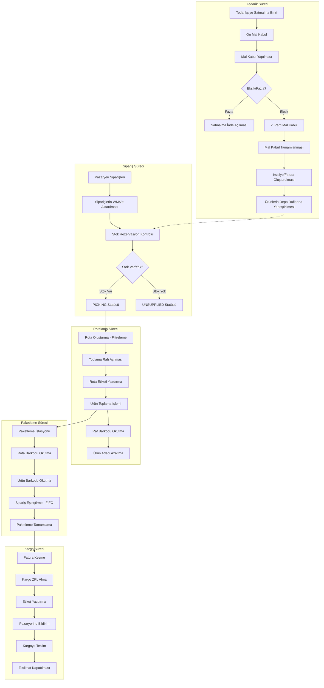
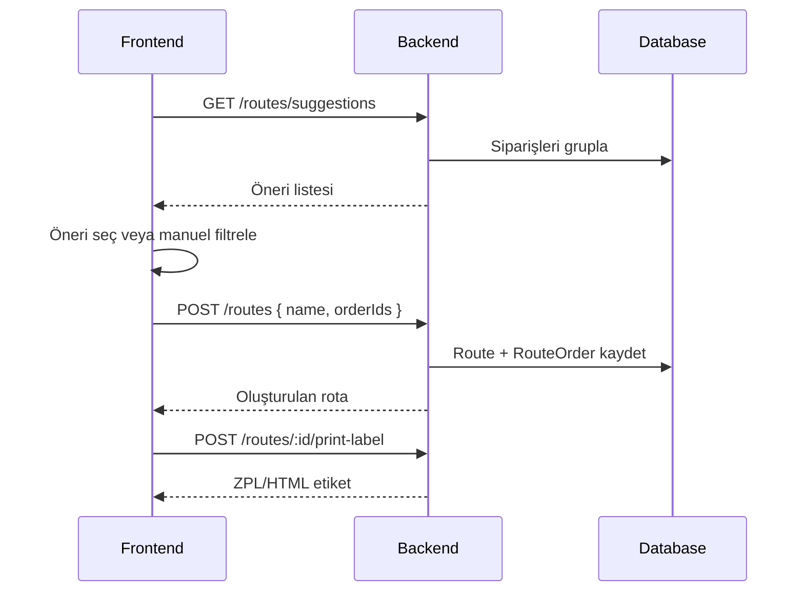
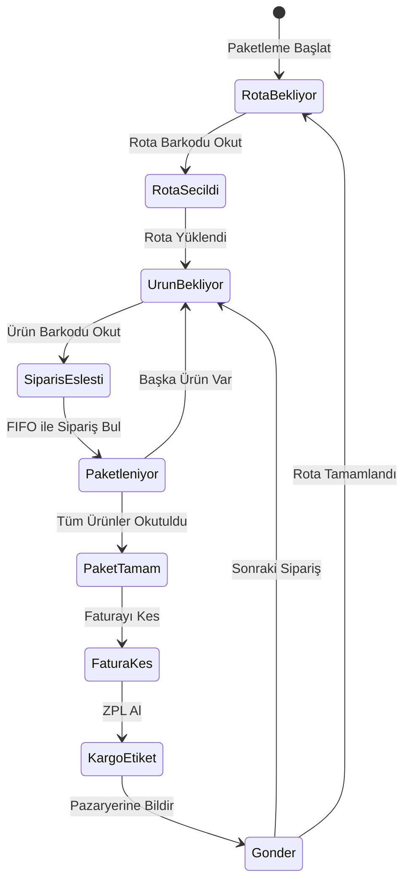
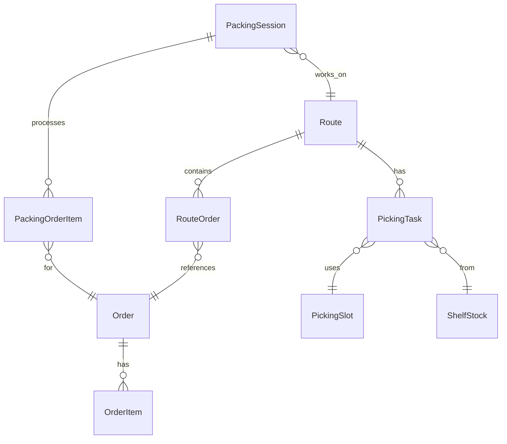

# Ambar-Hub WMS - Depo Yönetimi, Rotalama ve Paketleme Sistemi

> Bu doküman, depo yönetim sisteminin tam iş akışını, rotalama mantığını ve paketleme süreçlerini kapsamaktadır.

---

## 1. Genel İş Akışı



---

## 2. Rotalama Modülü

### 2.1 Route Entity

```typescript
enum RouteStatus {
  COLLECTING = 'COLLECTING',  // Toplanıyor
  READY = 'READY',            // Hazır
  COMPLETED = 'COMPLETED',    // Tamamlandı
  CANCELLED = 'CANCELLED',    // İptal Edildi
}

interface Route {
  id: string;
  name: string;
  description: string | null;
  status: RouteStatus;
  orders: Order[];          // N-N ilişki
  labelPrintedAt: Date | null;
  isActive: boolean;
  createdAt: Date;
  updatedAt: Date;
}

interface RouteOrder {
  routeId: string;
  orderId: string;
}
```

### 2.2 Filtreleme Parametreleri

| Parametre | Tip | Açıklama |
|-----------|-----|----------|
| `productBarcodes` | `string[]` | Belirli ürün barkodlarına göre filtrele |
| `brand` | `string` | Marka bazlı filtrele |
| `type` | `string` | Sipariş tipi: `single_product`, `single_product_multi`, `mixed` |
| `storeId` | `string` | Mağaza bazlı filtrele |
| `minOrderCount` / `maxOrderCount` | `number` | Sipariş aralığı |
| `minTotalQuantity` / `maxTotalQuantity` | `number` | Toplam adet aralığı |
| `overdue` | `boolean` | Gecikmiş siparişler |
| `search` | `string` | Sipariş no/müşteri arama |

### 2.3 Rota Önerileri (Route Suggestions)

Sistem otomatik rota önerileri oluşturur:

| Tip | Açıklama | Öncelik |
|-----|----------|---------|
| `single_product` | Tek ürün, tek adet siparişler | Yüksek |
| `single_product_multi` | Tek ürün, çoklu adet | Orta |
| `mixed` | Çoklu ürün siparişleri | Düşük |

```typescript
interface RouteSuggestion {
  id: string;
  type: 'single_product' | 'single_product_multi' | 'mixed';
  name: string;
  description: string;
  storeName?: string;
  storeId?: string;
  orderCount: number;
  totalQuantity: number;
  products: RouteSuggestionProduct[];
  orders: RouteSuggestionOrder[];
  priority: number;
}
```

### 2.4 Rota Oluşturma Akışı



---

## 3. Paketleme Modülü (Yeni Tasarım)

### 3.1 Paketleme İstasyonu Akışı



### 3.2 Paketleme Entity'leri

```typescript
enum PackingSessionStatus {
  ACTIVE = 'ACTIVE',
  COMPLETED = 'COMPLETED',
  CANCELLED = 'CANCELLED',
}

interface PackingSession {
  id: string;
  stationId: string;         // Paketleme istasyonu
  routeId: string;           // Aktif rota
  userId: string;            // Paketlemeci
  status: PackingSessionStatus;
  currentOrderId: string | null;
  startedAt: Date;
  completedAt: Date | null;
}

interface PackingOrderItem {
  id: string;
  sessionId: string;
  orderId: string;
  productId: string;
  barcode: string;
  requiredQuantity: number;
  scannedQuantity: number;
  isComplete: boolean;
  scannedAt: Date | null;
}
```

### 3.3 Paketleme Ekranı Tasarımı

**Ana Bileşenler:**

1. **Rota Bilgi Kartı** - Aktif rota ve istatistikler
2. **Barkod Okuma Alanı** - Rota/Ürün barkod girişi
3. **Aktif Sipariş Detayı** - Mevcut sipariş bilgileri
4. **Ürün Listesi** - Okutulması gereken ürünler
5. **Tamamlanan Siparişler** - Paketlenen siparişler

**Akış:**
1. Paketlemeci rota barkodunu okuttur
2. Sistem ilk siparişi FIFO ile seç
3. Ürün barkodunu okut
4. Sipariş tamamlanınca fatura kes
5. Kargo ZPL al ve yazdır
6. Sonraki siparişe geç

---

## 4. Toplama Rafı Modülü

### 4.1 Toplama Rafı Entity

```typescript
enum PickingSlotType {
  GLOBAL = 'GLOBAL',      // Genel toplama slotu
  DEDICATED = 'DEDICATED', // Ürüne özel slot
}

interface PickingSlot {
  id: string;
  shelfId: string;         // Bağlı raf
  slotNumber: string;      // Slot numarası (ör: A-01)
  barcode: string;         // Slot barkodu
  type: PickingSlotType;
  productId: string | null; // Dedicated için
  currentRouteId: string | null;
  isActive: boolean;
}

interface PickingTask {
  id: string;
  routeId: string;
  slotId: string;
  orderId: string;
  productId: string;
  quantity: number;
  pickedQuantity: number;
  sourceShelfId: string;   // Ürünün alınacağı raf
  status: 'PENDING' | 'IN_PROGRESS' | 'COMPLETED';
}
```

### 4.2 Toplama Akışı

```text
1. Rota oluşturulur
2. Sistem her sipariş için PickingTask oluşturur
3. Toplayıcı global slot'a rota barkodunu okuttur
4. Sistem sıradaki ürünün rafını gösterir
5. Toplayıcı rafa gidip ürünü alır
6. Raf barkodunu okutup miktarı düşer
7. Ürünü slot'a yerleştirir
8. Tüm ürünler toplanınca rota READY olur
```

---

## 5. API Endpoints

### 5.1 Routes API

| Method | Endpoint | Açıklama |
|--------|----------|----------|
| `GET` | `/routes` | Rota listesi |
| `GET` | `/routes/:id` | Rota detayı |
| `POST` | `/routes` | Rota oluştur |
| `DELETE` | `/routes/:id` | Rota iptal |
| `GET` | `/routes/filter-orders` | Siparişleri filtrele |
| `GET` | `/routes/suggestions` | Rota önerileri |
| `POST` | `/routes/:id/print-label` | Etiket yazdır |

### 5.2 Packing API (Yeni)

| Method | Endpoint | Açıklama |
|--------|----------|----------|
| `POST` | `/packing/start` | Paketleme başlat |
| `POST` | `/packing/scan-route` | Rota barkodu okut |
| `POST` | `/packing/scan-product` | Ürün barkodu okut |
| `POST` | `/packing/complete-order` | Sipariş tamamla |
| `POST` | `/packing/print-invoice` | Fatura yazdır |
| `POST` | `/packing/get-cargo-label` | Kargo ZPL al |
| `GET` | `/packing/session/:id` | Session bilgisi |

### 5.3 Picking API (Yeni)

| Method | Endpoint | Açıklama |
|--------|----------|----------|
| `GET` | `/picking/slots` | Toplama slotları |
| `POST` | `/picking/assign-route` | Rotayı slot'a ata |
| `POST` | `/picking/scan-shelf` | Raf barkodu okut |
| `POST` | `/picking/pick-item` | Ürün topla |
| `GET` | `/picking/next-task/:routeId` | Sıradaki görevi getir |

---

## 6. Veritabanı Şeması



---

## 7. Sonraki Adımlar

1. **Routes modülü** - integration-mist'ten adapte et
2. **PickingSlot entity** - Toplama rafı yapısını oluştur
3. **PickingTask entity** - Toplama görevleri
4. **PackingSession entity** - Paketleme oturumları
5. **Paketleme UI** - Web arayüzü tasarla
6. **Kargo entegrasyonu** - ZPL ve pazaryeri bildirimi

---

*Son Güncelleme: 2026-01-13*
