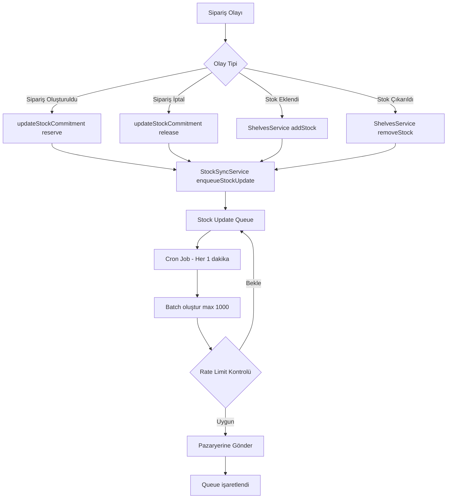

# Otomatik Pazaryeri Stok Senkronizasyon Planı

## 1. Mevcut Durum Analizi

### 1.0 Mevcut Loglama Altyapısı

Sistemde zaten [`OrderApiLog`](apps/api/src/orders/entities/order-api-log.entity.ts) yapısı mevcut:

```typescript
// apps/api/src/orders/entities/order-api-log.entity.ts
export enum ApiLogProvider {
    ARAS_KARGO = 'ARAS_KARGO',
    TRENDYOL = 'TRENDYOL',
    HEPSIBURADA = 'HEPSIBURADA',
    IKAS = 'IKAS',
    UYUMSOFT = 'UYUMSOFT',
}

export enum ApiLogType {
    SET_ORDER = 'SET_ORDER',
    GET_BARCODE = 'GET_BARCODE',
    UPDATE_STATUS = 'UPDATE_STATUS',
    GET_ORDER = 'GET_ORDER',
    CREATE_INVOICE = 'CREATE_INVOICE',
    OTHER = 'OTHER',
}
```

Bu yapı stok senkronizasyon logları için de kullanılacak.

### 1.1 Mevcut Stok Yönetimi Akışı

```
Sipariş Geliyor
    ↓
expandSetProduct() - Set ürünler bileşenlerine ayrılıyor
    ↓
updateStockCommitment() - Lokal stok rezerve ediliyor
    ↓
committedQuantity artıyor
sellableQuantity azalıyor
    ↓
❌ PAZARYERİNE GÜNCELLEME GÖNDERİLMİYOR
```

### 1.2 Mevcut Pazaryeri Entegrasyonu

**Trendyol:**
- Endpoint: `POST /integration/inventory/sellers/{sellerId}/products/price-and-inventory`
- Batch size: 1000 ürün
- Rate limit: 15 dakika içinde aynı istek tekrar edilemez
- Konum: [`stores.service.ts:sendTrendyolPriceAndInventory()`](apps/api/src/stores/stores.service.ts:170)

**Hepsiburada:**
- Endpoint: `POST /listings/merchantid/{merchantId}/stock-uploads`
- Fiyat ve stok ayrı endpoint'ler
- Konum: [`stores.service.ts:sendHepsiBuradaStock()`](apps/api/src/stores/stores.service.ts:400)

### 1.3 Tespit Edilen Sorunlar

| Sorun | Açıklama | Etki |
|-------|----------|------|
| **Manuel Tetikleme** | Stok güncellemesi sadece manuel çağrı ile çalışıyor | Ortak satma riski |
| **Set Ürün Hesaplama** | Set ürünler için bileşen bazlı stok hesaplaması yok | Yanlış stok bildirimi |
| **Rate Limiting** | Trendyol 15 dakika rate limit'i var | Güncellemeler birikebilir |
| **Batch Optimizasyonu** | Her değişiklik için ayrı çağrı yapılıyor | API limit aşımı |

---

## 2. Set Ürün Stok Hesaplama Mantığı

### 2.1 Set Ürün Stok Formülü

```
Set Stok Miktarı = MIN(
    (Bileşen 1 Stok / Bileşen 1 Miktar),
    (Bileşen 2 Stok / Bileşen 2 Miktar),
    ...
    (Bileşen N Stok / Bileşen N Miktar)
)
```

### 2.2 Örnek Senaryo

**Set Ürün:** "Kış Paketi" (SET-001)
- Mont: 50 adet stok, set içinde 1 adet
- Eldiven: 30 adet stok, set içinde 2 adet
- Atkı: 40 adet stok, set içinde 1 adet

**Hesaplama:**
```
Mont:  50 / 1 = 50 set yapılabilir
Eldiven: 30 / 2 = 15 set yapılabilir
Atkı:  40 / 1 = 40 set yapılabilir

Set Stok = MIN(50, 15, 40) = 15 adet
```

### 2.3 Veritabanı Sorgusu

Set ürünlerin stokunu hesaplamak için gereken sorgu:

```sql
SELECT 
    p.id AS set_product_id,
    p.barcode AS set_barcode,
    p.name AS set_name,
    MIN(FLOOR(ps.sellableQuantity / psi.quantity)) AS available_set_quantity
FROM products p
INNER JOIN product_set_items psi ON psi.set_product_id = p.id
INNER JOIN product_stores ps ON ps.product_id = psi.component_product_id
WHERE p.product_type = 'SET'
    AND ps.store_id = :storeId
    AND ps.sellable_quantity > 0
GROUP BY p.id
```

---

## 3. Mimari Tasarım

### 3.1 Yeni Servis: StockSyncService

```typescript
// apps/api/src/stock-sync/stock-sync.service.ts

@Injectable()
export class StockSyncService {
    // Stok değişikliklerini kuyruğa alır
    async enqueueStockUpdate(productId: string, storeId: string): Promise<void>

    // Kuyruktaki güncellemeleri toplu olarak işler
    async processStockQueue(): Promise<void>

    // Set ürünlerin stoğunu hesaplar
    async calculateSetStock(setProductId: string, storeId: string): Promise<number>

    // Pazaryerine stok güncellemesi gönderir
    async sendToMarketplace(storeId: string, items: StockUpdateItem[]): Promise<void>

    // Rate limiting kontrolü
    private async canSendToMarketplace(storeId: string): Promise<boolean>
}
```

### 3.2 Veri Yapıları

```typescript
interface StockUpdateQueue {
    id: string
    productId: string
    storeId: string
    reason: 'ORDER_CREATED' | 'ORDER_CANCELLED' | 'STOCK_ADDED' | 'STOCK_REMOVED'
    priority: number
    createdAt: Date
    processedAt: Date | null
}

interface StockUpdateItem {
    barcode: string
    quantity: number
    salePrice?: number
}

interface MarketplaceRateLimit {
    storeId: string
    lastSentAt: Date
    pendingCount: number
}
```

### 3.3 Akış Diyagramı



---

## 4. Implementasyon Adımları

### Adım 1: StockSyncService Oluştur

**Dosya:** `apps/api/src/stock-sync/stock-sync.service.ts`

```typescript
@Injectable()
export class StockSyncService {
    private readonly logger = new Logger(StockSyncService.name);
    private readonly QUEUE_TTL = 300000; // 5 dakika
    private readonly BATCH_SIZE = 1000;
    private readonly TRENDYOL_RATE_LIMIT_MS = 900000; // 15 dakika

    constructor(
        @InjectRepository(StockUpdateQueue)
        private queueRepository: Repository<StockUpdateQueue>,
        @InjectRepository(Product)
        private productRepository: Repository<Product>,
        @InjectRepository(ProductSetItem)
        private productSetItemRepository: Repository<ProductSetItem>,
        @InjectRepository(ProductStore)
        private productStoreRepository: Repository<ProductStore>,
        @InjectRepository(Store)
        private storeRepository: Repository<Store>,
    ) {}

    /**
     * Stok değişikliğini kuyruğa ekler
     */
    async enqueueStockUpdate(
        productId: string,
        storeId: string,
        reason: StockUpdateReason
    ): Promise<void> {
        // Ürün bir set ise, set'in kendisini kuyruğa ekle
        const product = await this.productRepository.findOne({
            where: { id: productId }
        });

        if (!product) return;

        // Set ürün ise, set ID'sini kullan
        const queueProductId = product.productType === ProductType.SET 
            ? product.id 
            : productId;

        // Bu ürünün parçası olduğu setleri bul
        const parentSets = await this.findParentSets(queueProductId, storeId);
        
        // Ana ürünü ve setleri kuyruğa ekle
        const productsToQueue = [queueProductId, ...parentSets];
        
        for (const pid of productsToQueue) {
            const existing = await this.queueRepository.findOne({
                where: {
                    productId: pid,
                    storeId,
                    processedAt: IsNull()
                }
            });

            if (!existing) {
                await this.queueRepository.save({
                    productId: pid,
                    storeId,
                    reason,
                    priority: this.calculatePriority(reason),
                    createdAt: new Date()
                });
            }
        }
    }

    /**
     * Ürünün parçası olduğu setleri bulur
     */
    private async findParentSets(
        productId: string,
        storeId: string
    ): Promise<string[]> {
        const result = await this.productSetItemRepository
            .createQueryBuilder('psi')
            .innerJoin('psi.setProduct', 'p')
            .innerJoin('p.productStores', 'ps')
            .where('psi.componentProductId = :productId', { productId })
            .andWhere('ps.storeId = :storeId', { storeId })
            .andWhere('p.productType = :setType', { setType: ProductType.SET })
            .select('p.id')
            .getMany();

        return result.map(r => r.setProductId);
    }

    /**
     * Kuyruktaki güncellemeleri işler (Cron job)
     */
    @Cron('*/1 * * * *') // Her 1 dakika
    async processStockQueue(): Promise<void> {
        this.logger.debug('Processing stock update queue...');

        // İşlenmemiş ve TTL geçmemiş kayıtları al
        const pendingItems = await this.queueRepository.find({
            where: {
                processedAt: IsNull(),
                createdAt: MoreThan(new Date(Date.now() - this.QUEUE_TTL))
            },
            order: { priority: 'DESC', createdAt: 'ASC' },
            take: this.BATCH_SIZE
        });

        if (pendingItems.length === 0) {
            return;
        }

        // Store bazında grupla
        const byStore = this.groupByStore(pendingItems);

        for (const [storeId, items] of Object.entries(byStore)) {
            await this.processStoreBatch(storeId, items);
        }
    }

    /**
     * Belirli bir mağaza için batch'i işler
     */
    private async processStoreBatch(
        storeId: string,
        items: StockUpdateQueue[]
    ): Promise<void> {
        const store = await this.storeRepository.findOne({
            where: { id: storeId }
        });

        if (!store || !store.isActive || !store.sendStock) {
            // İşlendi olarak işaretle
            await this.markAsProcessed(items);
            return;
        }

        // Rate limit kontrolü
        if (!await this.canSendToMarketplace(storeId)) {
            this.logger.debug(`Rate limit reached for store ${storeId}`);
            return;
        }

        // Stok verilerini hazırla
        const stockItems = await this.prepareStockItems(items, storeId);

        if (stockItems.length === 0) {
            await this.markAsProcessed(items);
            return;
        }

        // Pazaryerine gönder
        try {
            if (store.type === StoreType.TRENDYOL) {
                await this.sendToTrendyol(store, stockItems);
            } else if (store.type === StoreType.HEPSIBURADA) {
                await this.sendToHepsiburada(store, stockItems);
            }

            // Başarılı, işaretle
            await this.markAsProcessed(items);
            
            // Rate limit timestamp güncelle
            await this.updateLastSentTimestamp(storeId);
        } catch (error) {
            this.logger.error(`Failed to send stock update: ${error.message}`);
        }
    }

    /**
     * Stok öğelerini hazırlar (set hesaplaması dahil)
     */
    private async prepareStockItems(
        queueItems: StockUpdateQueue[],
        storeId: string
    ): Promise<StockUpdateItem[]> {
        const items: StockUpdateItem[] = [];
        const processedProductIds = new Set<string>();

        for (const queueItem of queueItems) {
            if (processedProductIds.has(queueItem.productId)) {
                continue;
            }
            processedProductIds.add(queueItem.productId);

            const product = await this.productRepository.findOne({
                where: { id: queueItem.productId }
            });

            if (!product || !product.barcode) continue;

            let quantity = 0;

            if (product.productType === ProductType.SET) {
                // Set ürün: bileşen bazlı hesaplama
                quantity = await this.calculateSetStock(
                    queueItem.productId,
                    storeId
                );
            } else {
                // Basit ürün: direkt sellable quantity
                const productStore = await this.productStoreRepository.findOne({
                    where: { productId: queueItem.productId, storeId }
                });
                quantity = productStore?.sellableQuantity ?? 0;
            }

            items.push({
                barcode: product.barcode,
                quantity: Math.max(0, Math.min(quantity, 20000))
            });
        }

        return items;
    }

    /**
     * Set ürün için kullanılabilir set miktarını hesaplar
     */
    async calculateSetStock(
        setProductId: string,
        storeId: string
    ): Promise<number> {
        const setItems = await this.productSetItemRepository.find({
            where: { setProductId },
            relations: ['componentProduct']
        });

        if (setItems.length === 0) return 0;

        let minQuantity = Infinity;

        for (const setItem of setItems) {
            const productStore = await this.productStoreRepository.findOne({
                where: {
                    productId: setItem.componentProductId,
                    storeId
                }
            });

            const availableQuantity = productStore?.sellableQuantity ?? 0;
            const setsFromComponent = Math.floor(availableQuantity / setItem.quantity);

            minQuantity = Math.min(minQuantity, setsFromComponent);
        }

        return minQuantity === Infinity ? 0 : minQuantity;
    }

    /**
     * Trendyol'a stok güncellemesi gönderir
     */
    private async sendToTrendyol(
        store: Store,
        items: StockUpdateItem[]
    ): Promise<void> {
        const url = `https://apigw.trendyol.com/integration/inventory/sellers/${store.sellerId}/products/price-and-inventory`;
        const auth = Buffer.from(`${store.apiKey}:${store.apiSecret}`).toString('base64');

        const response = await fetch(url, {
            method: 'POST',
            headers: {
                'Authorization': `Basic ${auth}`,
                'Content-Type': 'application/json',
            },
            body: JSON.stringify({ items })
        });

        if (!response.ok) {
            const errorText = await response.text();
            throw new Error(`Trendyol API error: ${response.status} - ${errorText}`);
        }

        this.logger.log(`Sent ${items.length} stock updates to Trendyol`);
    }

    /**
     * Hepsiburada'ya stok güncellemesi gönderir
     */
    private async sendToHepsiburada(
        store: Store,
        items: StockUpdateItem[]
    ): Promise<void> {
        const url = `https://listing-external.hepsiburada.com/listings/merchantid/${store.sellerId}/stock-uploads`;
        const auth = Buffer.from(`${store.apiKey}:${store.apiSecret}`).toString('base64');

        const stockItems = items.map(item => ({
            barcode: item.barcode,
            quantity: item.quantity
        }));

        const response = await fetch(url, {
            method: 'POST',
            headers: {
                'Authorization': `Basic ${auth}`,
                'Content-Type': 'application/json',
            },
            body: JSON.stringify(stockItems)
        });

        if (!response.ok) {
            const errorText = await response.text();
            throw new Error(`Hepsiburada API error: ${response.status} - ${errorText}`);
        }

        this.logger.log(`Sent ${items.length} stock updates to Hepsiburada`);
    }

    /**
     * Rate limit kontrolü
     */
    private async canSendToMarketplace(storeId: string): Promise<boolean> {
        const lastSent = await this.getLastSentTimestamp(storeId);
        if (!lastSent) return true;

        const elapsed = Date.now() - lastSent.getTime();
        return elapsed >= this.TRENDYOL_RATE_LIMIT_MS;
    }

    private calculatePriority(reason: StockUpdateReason): number {
        switch (reason) {
            case 'ORDER_CREATED': return 100;
            case 'ORDER_CANCELLED': return 90;
            case 'STOCK_REMOVED': return 80;
            case 'STOCK_ADDED': return 70;
            default: return 50;
        }
    }

    private groupByStore(items: StockUpdateQueue[]): Record<string, StockUpdateQueue[]> {
        return items.reduce((acc, item) => {
            if (!acc[item.storeId]) acc[item.storeId] = [];
            acc[item.storeId].push(item);
            return acc;
        }, {} as Record<string, StockUpdateQueue[]>);
    }

    private async markAsProcessed(items: StockUpdateQueue[]): Promise<void> {
        await this.queueRepository.update(
            items.map(i => i.id),
            { processedAt: new Date() }
        );
    }

    private async getLastSentTimestamp(storeId: string): Promise<Date | null> {
        // Cache veya veritabanından son gönderim zamanı
        // Implementasyon gerekiyor
        return null;
    }

    private async updateLastSentTimestamp(storeId: string): Promise<void> {
        // Cache veya veritabanına son gönderim zamanını kaydet
        // Implementasyon gerekiyor
    }
}
```

### Adım 2: Veritabanı Migration

**Dosya:** `apps/api/src/database/migrations/XXXXXXXXXXXXXX-CreateStockUpdateQueueTable.ts`

```typescript
import { MigrationInterface, QueryRunner, Table } from 'typeorm';

export class CreateStockUpdateQueueTableXXXXXXXXXXXXXX implements MigrationInterface {
    public async up(queryRunner: QueryRunner): Promise<void> {
        await queryRunner.createTable(
            new Table({
                name: 'stock_update_queue',
                columns: [
                    {
                        name: 'id',
                        type: 'uuid',
                        isPrimary: true,
                        generationStrategy: 'uuid',
                        default: 'UUID()',
                    },
                    {
                        name: 'product_id',
                        type: 'uuid',
                    },
                    {
                        name: 'store_id',
                        type: 'uuid',
                    },
                    {
                        name: 'reason',
                        type: 'enum',
                        enum: ['ORDER_CREATED', 'ORDER_CANCELLED', 'STOCK_ADDED', 'STOCK_REMOVED'],
                    },
                    {
                        name: 'priority',
                        type: 'int',
                        default: 50,
                    },
                    {
                        name: 'created_at',
                        type: 'timestamp',
                        default: 'CURRENT_TIMESTAMP',
                    },
                    {
                        name: 'processed_at',
                        type: 'timestamp',
                        isNullable: true,
                    },
                ],
                indices: [
                    {
                        name: 'IDX_stock_queue_pending',
                        columnNames: ['processed_at', 'created_at'],
                    },
                    {
                        name: 'IDX_stock_queue_store',
                        columnNames: ['store_id'],
                    },
                    {
                        name: 'IDX_stock_queue_product',
                        columnNames: ['product_id'],
                    },
                ],
            }),
            true
        );
    }

    public async down(queryRunner: QueryRunner): Promise<void> {
        await queryRunner.dropTable('stock_update_queue');
    }
}
```

### Adım 3: OrdersService Entegrasyonu

**Dosya:** `apps/api/src/orders/orders.service.ts`

```typescript
// Mevcut updateStockCommitment metoduna ekle:

private async updateStockCommitment(order: Order, action: 'reserve' | 'release') {
    const factor = action === 'reserve' ? 1 : -1;
    const items = await this.orderItemRepository.find({ where: { orderId: order.id } });

    for (const item of items) {
        const storeId = order.storeId;
        if (!storeId) continue;

        let productId = null;
        if (item.barcode) {
            const product = await this.productRepository.findOne({ where: { barcode: item.barcode } });
            if (product) productId = product.id;
        }

        if (!productId && item.sku) {
            const product = await this.productRepository.findOne({ where: { sku: item.sku } });
            if (product) productId = product.id;
        }

        if (!productId) continue;

        const productStore = await this.productStoreRepository.findOne({
            where: { productId, storeId }
        });

        if (productStore) {
            const change = item.quantity * factor;
            productStore.committedQuantity = Math.max(0, (productStore.committedQuantity || 0) + change);
            productStore.sellableQuantity = Math.max(0, productStore.sellableQuantity - change);
            await this.productStoreRepository.save(productStore);

            // YENİ: Stok senkronizasyonunu tetikle
            const reason = action === 'reserve' ? 'ORDER_CREATED' : 'ORDER_CANCELLED';
            await this.stockSyncService.enqueueStockUpdate(productId, storeId, reason);
        }
    }
}
```

### Adım 4: ShelvesService Entegrasyonu

**Dosya:** `apps/api/src/shelves/shelves.service.ts`

```typescript
// addStock ve removeStock metotlarına ekle:

async addStock(shelfId: string, productId: string, quantity: number): Promise<ShelfStock> {
    // ... mevcut kod ...
    
    // YENİ: Stok senkronizasyonunu tetikle
    const shelf = await this.shelfRepository.findOne({ where: { id: shelfId } });
    if (shelf?.warehouse?.stores) {
        for (const store of shelf.warehouse.stores) {
            await this.stockSyncService.enqueueStockUpdate(
                productId,
                store.id,
                'STOCK_ADDED'
            );
        }
    }
    
    return result;
}

async removeStock(shelfId: string, productId: string, quantity: number): Promise<ShelfStock> {
    // ... mevcut kod ...
    
    // YENİ: Stok senkronizasyonunu tetikle
    const shelf = await this.shelfRepository.findOne({ where: { id: shelfId } });
    if (shelf?.warehouse?.stores) {
        for (const store of shelf.warehouse.stores) {
            await this.stockSyncService.enqueueStockUpdate(
                productId,
                store.id,
                'STOCK_REMOVED'
            );
        }
    }
    
    return result;
}
```

### Adım 5: StockSyncModule Oluştur

**Dosya:** `apps/api/src/stock-sync/stock-sync.module.ts`

```typescript
import { Module } from '@nestjs/common';
import { TypeOrmModule } from '@nestjs/typeorm';
import { ScheduleModule } from '@nestjs/schedule';
import { StockSyncService } from './stock-sync.service';
import { StockUpdateQueue } from './entities/stock-update-queue.entity';
import { Product } from '../products/entities/product.entity';
import { ProductSetItem } from '../products/entities/product-set-item.entity';
import { ProductStore } from '../product-stores/entities/product-store.entity';
import { Store } from '../stores/entities/store.entity';

@Module({
    imports: [
        TypeOrmModule.forFeature([
            StockUpdateQueue,
            Product,
            ProductSetItem,
            ProductStore,
            Store,
        ]),
        ScheduleModule.forRoot(),
    ],
    providers: [StockSyncService],
    exports: [StockSyncService],
})
export class StockSyncModule {}
```

### Adım 6: AppModule'e Ekle

**Dosya:** `apps/api/src/app.module.ts`

```typescript
import { StockSyncModule } from './stock-sync/stock-sync.module';

@Module({
    imports: [
        // ... diğer modüller ...
        StockSyncModule,
    ],
    // ...
})
export class AppModule {}
```

---

## 5. Test Senaryoları

### 5.1 Set Ürün Stok Hesaplama Testi

```typescript
describe('StockSyncService - Set Stock Calculation', () => {
    it('should calculate set stock correctly', async () => {
        // Setup:
        // - Mont: 50 adet
        // - Eldiven: 30 adet (set içinde 2 adet)
        // - Atkı: 40 adet
        
        const result = await service.calculateSetStock('set-123', 'store-456');
        
        // Expected: MIN(50, 30/2, 40) = MIN(50, 15, 40) = 15
        expect(result).toBe(15);
    });
    
    it('should return 0 when any component is out of stock', async () => {
        // Setup: Eldiven stoğu 0
        
        const result = await service.calculateSetStock('set-123', 'store-456');
        
        expect(result).toBe(0);
    });
});
```

### 5.2 Rate Limiting Testi

```typescript
describe('StockSyncService - Rate Limiting', () => {
    it('should respect Trendyol 15 minute rate limit', async () => {
        // İlk gönderim başarılı
        await service.processStockQueue();
        
        // 15 dakika içinde ikinci gönderim beklemeli
        await service.processStockQueue();
        
        // Queue'daki öğeler işlenmemiş olmalı
        const pending = await queueRepository.find({
            where: { processedAt: IsNull() }
        });
        
        expect(pending.length).toBeGreaterThan(0);
    });
});
```

### 5.3 Entegrasyon Testi

```typescript
describe('StockSyncService - Integration', () => {
    it('should sync stock after order creation', async () => {
        // Sipariş oluştur
        const order = await createTestOrder({
            items: [{ barcode: 'SET-001', quantity: 2 }]
        });
        
        // Stok rezerve edildi
        const productStore = await productStoreRepository.findOne({
            where: { productId: 'mont-123', storeId: order.storeId }
        });
        
        expect(productStore.committedQuantity).toBe(2);
        
        // 1 dakika bekle (cron job çalışsın)
        await sleep(60000);
        
        // Pazaryerine güncelleme gitti mi?
        // API mock ile kontrol et
    });
});
```

---

## 6. Deployment Planı

### 6.1 Aşamalı Rollout

1. **Phase 1 - Development:**
   - StockSyncService implementasyonu
   - Unit testler
   - Mock pazaryeri API'leri ile test

2. **Phase 2 - Staging:**
   - Gerçek pazaryeri API'leri ile test
   - Rate limiting testleri
   - Performans testleri

3. **Phase 3 - Production (Canary):**
   - Sadece bir mağaza için aktif
   - 1 hafta izleme

4. **Phase 4 - Production (Full):**
   - Tüm mağazalar için aktif
   - Monitoring dashboard

### 6.2 Monitoring

```typescript
// Metrics to track:
- Stock update queue size
- Processing time per batch
- API success/failure rate
- Rate limit hits
- Set stock calculation accuracy
```

---

## 7. Riskler ve Mitigasyon

| Risk | Olasılık | Etki | Mitigasyon |
|------|----------|------|------------|
| API Rate Limit Aşımı | Orta | Yüksek | Queue sistemi ve priority |
| Yanlış Stok Hesaplama | Düşük | Yüksek | Unit testler ve validation |
| Queue Birikmesi | Orta | Orta | Auto-scaling ve batch size tuning |
| Pazaryeri API Değişikliği | Düşek | Orta | Versioning ve fallback |

---

## 8. Alternatif Yaklaşımlar

### 8.1 Event-Driven (Kafka/RabbitMQ)

Avantajları:
- Daha iyi scalability
- Decoupled architecture
- Retry mekanizması built-in

Dezavantajları:
- Ek altyapı maliyeti
- Operasyonel karmaşıklık

### 8.2 Webhook-Based

Pazaryerlerinin webhook'larını kullanarak stok değişikliklerini dinlemek.

Avantajları:
- Real-time güncelleme
- Polling yok

Dezavantajları:
- Tüm pazaryerleri desteklemiyor
- Webhook yönetimi karmaşık

---

## 9. Sonraki Adımlar

1. Implementasyon onayı al
2. StockSyncService'i kodla
3. Unit testleri yaz
4. Staging'de test et
5. Production'a deploy et
6. Monitoring dashboard oluştur
