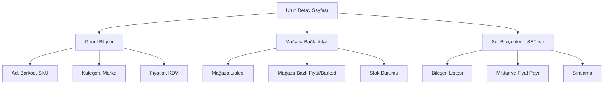

# Ürün İçe Aktarma ve Set Ürün Yönetimi İyileştirme Planı

## Mevcut Durum Analizi

### Excel Yapısı

Mevcut Excel dosyası şu kolonları içeriyor:

| Kolon | Açıklama | Mevcut Kullanım |
|-------|----------|-----------------|
| A | Ürün Adı | Product.name |
| B | Set mi? | Product.productType (Hayır=SIMPLE, Evet=SET) |
| C | Marka | Brand.name |
| D | SKU | Product.sku |
| E | Ürün Tipi | Önemsiz |
| F | Barkod | Product.barcode |
| G | Kategori | Category (hierarchy: Ana > Alt) |
| H | KDV | Product.vatRate |
| I | Alış Fiyatı | Product.purchasePrice |
| J | Satış Fiyatı | Product.salePrice |
| K | Trendyol Barkod | ProductStore.storeBarcode (Trendyol mağazası) |
| L | Hepsiburada Barkod | ProductStore.storeBarcode (Hepsiburada mağazası) |
| M | Hepsiburada SKU | ProductStore.storeSku (Hepsiburada mağazası) |
| N | Uyumsoft Barkod/SKU | ProductStore.storeBarcode (Uyumsoft mağazası) |
| O | İKAS Barkod | ProductStore.storeBarcode (İKAS mağazas��) |
| P | İKAS Ürün Grup ID | İKAS spesifik alan |
| Q | İKAS Varyant ID | İKAS spesifik alan |

### Set Ürün Sorunu

Set ürünler (satır 34-38) şu şekilde temsil ediliyor:
- `8684990400242-8684990400020` (iki barkod `-` ile ayrılmış)
- `8684990400242-2` (aynı üründen 2 adet)

Bu format şu sorunları yaratıyor:
1. Set bileşenlerini barkod ile eşleştirmek zor
2. Aynı üründen birden fazla adet varsa ayırt edilemiyor
3. İKAS varyant/ürün grup ID'leri set ürünlerde boş

## Önerilen Çözümler

### Seçenek 1: Excel Formatını Standartlaştırma (Önerilen)

#### Yeni Excel Formatı

**Sheet 1: Ürünler (Products)**

| Kolon | Açıklama | Zorunlu |
|-------|----------|---------|
| Ürün Adı | Product.name | Evet |
| Set mi? | SIMPLE/SET | Evet |
| Marka | Brand.name | Hayır |
| SKU | Product.sku | Evet |
| Barkod | Product.barcode | Evet |
| Kategori | Category (hierarchy) | Evet |
| KDV | Product.vatRate | Evet |
| Alış Fiyatı | Product.purchasePrice | Hayır |
| Satış Fiyatı | Product.salePrice | Evet |
| Desi | Product.desi | Hayır |

**Sheet 2: Mağaza Bağlantıları (Store Mappings)**

| Kolon | Açıklama |
|-------|----------|
| Barkod/SKU | Ürün eşleştirme için |
| Mağaza | Trendyol / Hepsiburada / İKAS / Uyumsoft |
| Mağaza Barkod | storeBarcode |
| Mağaza SKU | storeSku |
| Aktif mi? | isActive |
| Fiyat | storeSalePrice (opsiyonel) |

**Sheet 3: Set Bileşenleri (Set Components)**

| Kolon | Açıklama |
|-------|----------|
| Set Barkod/SKU | Set ürünün barkodu/SKU'su |
| Bileşen Barkod/SKU | Bileşen ürünün barkodu/SKU'su |
| Miktar | Set içindeki adet |
| Fiyat Payı | priceShare (opsiyonel) |
| Sıra | sortOrder |

### Seçenek 2: Set Ürünler İçin Özel Format

Set ürünleri tek satırda tutmak yerine, bileşenleri alt satırlarda göster:

```
| Set Ürün Adı | SET | Marka | Set SKU | Set Barkod | ... |
| └─ Bileşen 1 Adı | BİLEŞEN | | Bileşen SKU | Bileşen Barkod | ... | Miktar: 2 |
| └─ Bileşen 2 Adı | BİLEŞEN | | Bileşen SKU | Bileşen Barkod | ... | Miktar: 1 |
```

## UI/UX İyileştirmeleri

### 1. Ürün Detay Sayfası



### 2. Set Ürün Oluşturma/Düzenleme Modalı

```
┌─────────────────────────────────────────────────────────────┐
│  Set Ürün Düzenle: Saç Bakım Seti                           │
├─────────────────────────────────────────────────────────────┤
│                                                             │
│  Genel Bilgiler:                                             │
│  ┌─────────────────────────────────────────────────────┐   │
│  │ Set Adı: [Saç Bakım Seti                           ]   │   │
│  │ Set Fiyatı: [299.90                              ]   │   │
│  │ SKU: [SET-SAC-001                               ]   │   │
│  │ Barkod: [8690000000001                           ]   │   │
│  └─────────────────────────────────────────────────────┘   │
│                                                             │
│  Bileşenler:                                                 │
│  ┌─────────────────────────────────────────────────────┐   │
│  │ Ürün          │ Barkod        │ Miktar │ Fiyat Payı │   │
│  ├─────────────────────────────────────────────────────┤   │
│  │ Şampuan 400ml │ 8684990400136 │ 1      │ 99.90     │   │
│  │ Saç Sütü 200ml│ 8684990400129 │ 1      │ 99.90     │   │
│  │ Saç Maskesi   │ 8684990400013 │ 1      │ 100.10    │   │
│  │ [+ Bileşen Ekle]                                    │   │
│  └─────────────────────────────────────────────────────┘   │
│                                                             │
│  Hesaplanan Set Stok: 15 adet (en az stoklu bileşen)       │
│                                                             │
│                    [İptal] [Kaydet]                         │
└─────────────────────────────────────────────────────────────┘
```

### 3. Mağaza Bağlantıları Tablosu

```
┌────────────────────────────────────────────────────────────────────────────┐
│ Mağaza Bağlantıları                                                        │
├────────────────────────────────────────────────────────────────────────────┤
│                                                                            │
│  [Tüm Mağazalar ▼] Filtrele    [Mağaza Ekle]                              │
│                                                                            │
│  ┌──────────────────────────────────────────────────────────────────────┐ │
│  │ Mağaza        │ Barkod        │ SKU           │ Fiyat   │ Stok │ Durum│ │
│  ├──────────────────────────────────────────────────────────────────────┤ │
│  │ Trendyol      │ 8684990400136 │ TREND-001     │ 599.90  │ 85   │ Aktif│ │
│  │ Hepsiburada   │ 8684990400136 │ HBC00006PCI0Z │ 599.90  │ 85   │ Aktif│ │
│  │ İKAS          │ 8684990400136 │ -             │ 599.90  │ 85   │ Aktif│ │
│  │ Manuel        │ -             │ -             │ 599.90  │ 100  │ Aktif│ │
│  └──────────────────────────────────────────────────────────────────────┘ │
└────────────────────────────────────────────────────────────────────────────┘
```

## API İyileştirmeleri

### 1. Gelişmiş Import Endpoint

```typescript
POST /products/import-advanced

Request:
{
  "products": [...],        // Sheet 1: Ürünler
  "storeMappings": [...],   // Sheet 2: Mağaza bağlantıları
  "setComponents": [...]    // Sheet 3: Set bileşenleri
}

Response:
{
  "success": true,
  "summary": {
    "productsCreated": 30,
    "productsUpdated": 5,
    "storesLinked": 120,
    "setComponentsAdded": 15,
    "errors": []
  }
}
```

### 2. Set Ürün Hesaplama Endpoint

```typescript
GET /products/:id/set-stock

Response:
{
  "productId": "uuid",
  "productName": "Saç Bakım Seti",
  "availableStock": 15,
  "components": [
    {
      "productId": "uuid",
      "productName": "Şampuan 400ml",
      "stock": 50,
      "requiredQuantity": 1,
      "setsFromComponent": 50
    },
    {
      "productId": "uuid",
      "productName": "Saç Sütü 200ml",
      "stock": 15,
      "requiredQuantity": 1,
      "setsFromComponent": 15
    }
  ],
  "limitingComponent": "Saç Sütü 200ml"
}
```

## Veritabanı Değişiklikleri

### ProductStore Entity - İKAS Alanları Ekleme

```typescript
@Entity('product_stores')
export class ProductStore extends BaseEntity {
  // ... mevcut alanlar ...

  // İKAS spesifik alanlar
  @Column({ name: 'ikas_product_group_id', type: 'varchar', length: 255, nullable: true })
  ikasProductGroupId: string;

  @Column({ name: 'ikas_variant_id', type: 'varchar', length: 255, nullable: true })
  ikasVariantId: string;
}
```

## Uygulama Adımları

### Faz 1: Veritabanı ve Backend

1. ProductStore entity'sine İKAS alanlarını ekle
2. Migration oluştur ve çalıştır
3. ProductStoresService'i güncelle
4. Gelişmiş import endpoint'i oluştur
5. Set stok hesaplama endpoint'i oluştur

### Faz 2: Frontend - Ürün Yönetimi

1. Ürün detay sayfasını yeniden tasarla
2. Mağaza bağlantıları tablosu ekle
3. Set ürün düzenleme modalı oluştur
4. Stok durumu göstergeleri ekle

### Faz 3: Frontend - Import

1. Çoklu sheet destekli import component'i oluştur
2. Excel şablonu oluştur (3 sheet)
3. Validasyon ve hata gösterimi
4. Önizleme ekranı

### Faz 4: Test ve Dokümantasyon

1. Unit testler yaz
2. Kullanıcı dokümantasyonu hazırla
3. Video tutorial oluştur

## Önceliklendirme

### Yüksek Öncelik

1. İKAS alanlarını veritabanına ekle
2. Set ürün UI/UX iyileştirmesi
3. Gelişmiş import endpoint'i

### Orta Öncelik

1. Mağaza bağlantıları tablosu
2. Set stok hesaplama endpoint'i
3. Excel şablonu standardizasyonu

### Düşük Öncelik

1. Video tutorial
2. Kullanıcı dokümantasyonu
3. Batch işlemler için ilerleme çubuğu

## Riskler ve Mitigasyon

### Risk 1: Mevcut Excel Formatına Bağımlılık

**Mitigasyon:** Eski formatı desteklemeye devam eden bir legacy import endpoint'i tut

### Risk 2: Set Ürün Bileşen Eşleştirme Hataları

**Mitigasyon:** Import sırasında validation ve uyarı mesajları göster

### Risk 3: Büyük Excel Dosyaları İçin Performans

**Mitigasyon:** Batch processing ve queue sistemi kullan

## Başarı Kriterleri

1. Kullanıcı Excel'den ürünleri 3 dakikada içe aktarabilecek
2. Set ürün oluşturma 1 dakikadan kısa sürede tamamlanacak
3. Mağaza bağlantıları tek ekrandan yönetilebilecek
4. Set stok durumu anlık görüntülenebilecek
