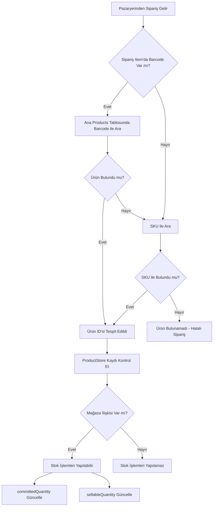
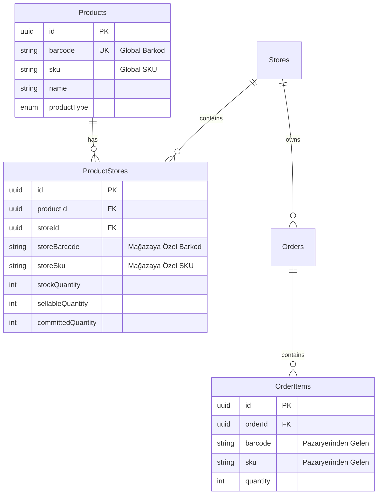

# Ürün Eşleştirme Mantığı - Product Matching Logic

## Mevcut Durum Özeti

Ambar Hub sisteminde ürün eşleştirme, pazaryerlerinden gelen siparişlerdeki ürünlerin sistemdeki ana ürün veritabanı ile eşleştirilmesi işlemidir. Bu eşleştirme **çift katmanlı** bir yapıda çalışır:

1. **Ana Ürün Veritabanı (Products Tablosu)**: Sistemdeki tüm ürünlerin merkezi kaydı
2. **Mağaza-Ürün İlişkileri (ProductStores Tablosu)**: Her ürünün mağazalara özgü bilgileri

## Ürün Eşleştirme Stratejisi

### 1. Ürün Bulma Öncelik Sırası

Sipariş geldiğinde ürün eşleştirme şu sırayla yapılır:

```typescript
// Kaynak: apps/api/src/orders/orders.service.ts (Satır 1046-1055)

// 1. ÖNCE BARCODE ile ara
if (item.barcode) {
    const product = await productRepository.findOne({ 
        where: { barcode: item.barcode } 
    });
    if (product) productId = product.id;
}

// 2. Barcode ile bulunamazsa SKU ile ara
if (!productId && item.sku) {
    const product = await productRepository.findOne({ 
        where: { sku: item.sku } 
    });
    if (product) productId = product.id;
}
```

**Eşleştirme Önceliği:**
1. **Barcode** (Barkod) - İlk tercih
2. **SKU** (Stok Kodu) - Yedek seçenek

### 2. Eşleştirme Alanları

#### Products Tablosunda (Ana Ürün Kayıtları)
```typescript
// apps/api/src/products/entities/product.entity.ts
{
  barcode: string;  // Unique, null olabilir - Global barkod
  sku: string;      // Stok kodu - Ana SKU
}
```

#### ProductStores Tablosunda (Mağazaya Özel Bilgiler)
```typescript
// apps/api/src/product-stores/entities/product-store.entity.ts
{
  storeBarcode: string;    // Mağazaya özel barkod
  storeSku: string;        // Mağazaya özel SKU
  storeSalePrice: number;  // Mağazaya özel satış fiyatı
}
```

### 3. Eşleştirme Akışı



## Önemli Noktalar

### ✅ Mevcut Durum

1. **Global Barkod Eşleştirme**: Sistem, pazaryerinden gelen barkod ile `Products` tablosundaki global barkod alanını karşılaştırır
2. **SKU Yedek Eşleştirme**: Barkod bulunamazsa, SKU ile eşleştirme yapılır
3. **Mağaza Bazlı Stok Yönetimi**: Her ürün-mağaza kombinasyonu için ayrı stok takibi yapılır

### ⚠️ Mevcut Sınırlamalar

1. **Mağazaya Özel Barkod/SKU Kullanılmıyor**: `ProductStores` tablosunda `storeBarcode` ve `storeSku` alanları olmasına rağmen, eşleştirme yapılırken bu alanlar kullanılmıyor

2. **Tek Yönlü Eşleştirme**: Sadece `Products` tablosundaki global barcode/SKU ile eşleştirme yapılıyor

### 📍 Kod Lokasyonları

#### Ürün Eşleştirme Fonksiyonu
- **Dosya**: `apps/api/src/orders/orders.service.ts`
- **Satırlar**: 1040-1078 (`updateStockReservations` metodu)
- **Satırlar**: 167-179 (`checkProductsExist` metodu)
- **Satırlar**: 1080-1115 (`checkStockAvailability` metodu)

#### Mağazaya Özel Barkod Arama
- **Dosya**: `apps/api/src/product-stores/product-stores.service.ts`
- **Satırlar**: 146-151 (`findByStoreBarcode` metodu)
- **Not**: Bu metod var ama kullanılmıyor

#### Sipariş Senkronizasyonu
- **Dosya**: `apps/api/src/orders/order-sync.service.ts`
- **Satırlar**: 46-77 (`syncNewOrdersJob` - Her 10 dakikada bir çalışır)

## Öneriler

### 🎯 Geliştirme Önerileri

Eğer mağazaya özel barkod/SKU eşleştirme eklenmek istenirse:

1. **Öncelik Sırasını Genişlet**:
```typescript
// Önerilen Eşleştirme Sırası:
1. Mağazaya özel barkod (storeBarcode)
2. Global barkod (barcode)
3. Mağazaya özel SKU (storeSku)
4. Global SKU (sku)
```

2. **Eşleştirme Fonksiyonunu Güncelle**:
```typescript
async findProductByStoreAndCode(storeId: string, barcode?: string, sku?: string) {
  // 1. Önce ProductStore'da mağazaya özel ara
  if (barcode) {
    const ps = await productStoreRepository.findOne({
      where: { storeId, storeBarcode: barcode },
      relations: ['product']
    });
    if (ps) return ps.product;
  }
  
  // 2. Global barkod ile ara
  if (barcode) {
    const product = await productRepository.findOne({ 
      where: { barcode } 
    });
    if (product) return product;
  }
  
  // 3. Mağazaya özel SKU ile ara
  if (sku) {
    const ps = await productStoreRepository.findOne({
      where: { storeId, storeSku: sku },
      relations: ['product']
    });
    if (ps) return ps.product;
  }
  
  // 4. Global SKU ile ara
  if (sku) {
    const product = await productRepository.findOne({ 
      where: { sku } 
    });
    if (product) return product;
  }
  
  return null;
}
```

### 📊 Veri Modeli



## Özet

**Mevcut Eşleştirme Yöntemi:**
- Pazaryerinden gelen `barcode` → `Products.barcode` ile eşleştir
- Bulunamazsa `sku` → `Products.sku` ile eşleştir
- Mağazaya özel alanlar (`storeBarcode`, `storeSku`) şu an **kullanılmıyor**

**Kullanım Senaryosu:**
- Trendyol'dan sipariş gelir, ürünün barkodu: "8699123456789"
- Sistem `Products` tablosunda `barcode = "8699123456789"` olan ürünü arar
- Bulunca `ProductStores` tablosunda bu ürünün Trendyol mağazasındaki stok bilgilerini kontrol eder
- Stok rezervasyonu yapar: `committedQuantity` artırır, `sellableQuantity` azaltır

**Avantajları:**
- Basit ve hızlı eşleştirme
- Tüm mağazalarda aynı barkodlar kullanılıyorsa sorunsuz çalışır

**Dezavantajları:**
- Mağazaya özel farklı barkodlar kullanılıyorsa eşleştirme yapılamaz
- ProductStores'daki `storeBarcode` ve `storeSku` alanları atıl durumda
