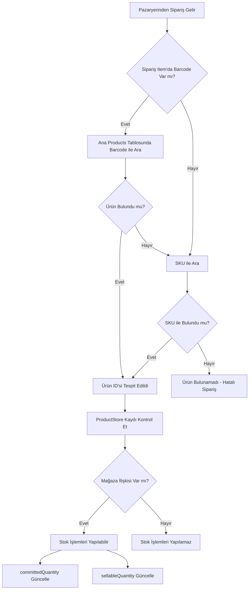
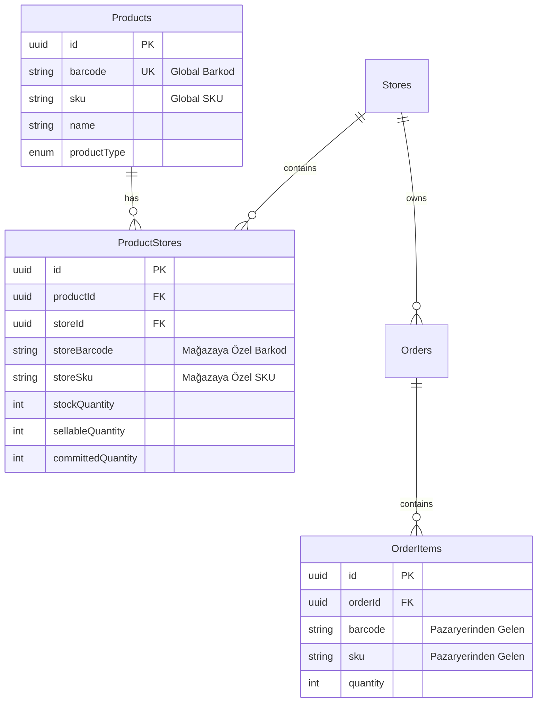

# Ürün Eşleştirme Mantığı - Product Matching Logic

## Mevcut Durum Özeti

Ambar Hub sisteminde ürün eşleştirme, pazaryerlerinden gelen siparişlerdeki ürünlerin sistemdeki ana ürün veritabanı ile eşleştirilmesi işlemidir. Bu eşleştirme **çift katmanlı** bir yapıda çalışır:

1. **Ana Ürün Veritabanı (Products Tablosu)**: Sistemdeki tüm ürünlerin merkezi kaydı
2. **Mağaza-Ürün İlişkileri (ProductStores Tablosu)**: Her ürünün mağazalara özgü bilgileri

## Ürün Eşleştirme Stratejisi

### 1. Ürün Bulma Öncelik Sırası

Sipariş geldiğinde ürün eşleştirme şu sırayla yapılır:

```typescript
// Kaynak: apps/api/src/orders/orders.service.ts (Satır 1047-1063)

// 1. ÖNCE MAĞAZAYA ÖZEL barkod/SKU ile ara
const storeProduct = await this.productStoresService.findProductByStoreCode(storeId, item.barcode, item.sku);
if (storeProduct) {
    productId = storeProduct.id;
}

// 2. Mağazaya özel bulunamazsa GLOBAL barkod ile ara
if (!productId && item.barcode) {
    const product = await this.productRepository.findOne({
        where: { barcode: item.barcode }
    });
    if (product) productId = product.id;
}

// 3. Global SKU ile ara
if (!productId && item.sku) {
    const product = await this.productRepository.findOne({
        where: { sku: item.sku }
    });
    if (product) productId = product.id;
}
```

**Eşleştirme Önceliği:**
1. **Mağazaya Özel Barkod/SKU** (`storeBarcode`, `storeSku`) - İlk tercih
2. **Global Barkod** (`barcode`) - İkinci tercih
3. **Global SKU** (`sku`) - Son yedek

### 2. Eşleştirme Alanları

#### Products Tablosunda (Ana Ürün Kayıtları)
```typescript
// apps/api/src/products/entities/product.entity.ts
{
  barcode: string;  // Unique, null olabilir - Global barkod
  sku: string;      // Stok kodu - Ana SKU
}
```

#### ProductStores Tablosunda (Mağazaya Özel Bilgiler)
```typescript
// apps/api/src/product-stores/entities/product-store.entity.ts
{
  storeBarcode: string;    // Mağazaya özel barkod
  storeSku: string;        // Mağazaya özel SKU
  storeSalePrice: number;  // Mağazaya özel satış fiyatı
}
```

### 3. Eşleştirme Akışı



## Önemli Noktalar

### ✅ Güncel Durum (2026-01-27)

1. **Mağazaya Özel Eşleştirme**: Öncelikle `ProductStores` tablosundaki `storeBarcode` ve `storeSku` alanları ile eşleştirme yapılır
2. **Global Barkod/SKU Yedekleme**: Mağazaya özel eşleşme bulunamazsa, `Products` tablosundaki global `barcode` ve `sku` ile eşleştirme yapılır
3. **Mağaza Bazlı Stok Yönetimi**: Her ürün-mağaza kombinasyonu için ayrı stok takibi yapılır

### ⚠️ Mevcut Sınırlamalar

1. ~~**Mağazaya Özel Barkod/SKU Kullanılmıyor**: `ProductStores` tablosunda `storeBarcode` ve `storeSku` alanları olmasına rağmen, eşleştirme yapılırken bu alanlar kullanılmıyor~~ ✅ **ÇÖZÜLDÜ**

2. ~~**Tek Yönlü Eşleştirme**: Sadece `Products` tablosundaki global barcode/SKU ile eşleştirme yapılıyor~~ ✅ **ÇÖZÜLDÜ**

### 📍 Kod Lokasyonları

#### Ürün Eşleştirme Fonksiyonu
- **Dosya**: `apps/api/src/orders/orders.service.ts`
- **Satırlar**: 1040-1078 (`updateStockReservations` metodu)
- **Satırlar**: 167-179 (`checkProductsExist` metodu)
- **Satırlar**: 1080-1115 (`checkStockAvailability` metodu)

#### Mağazaya Özel Barkod Arama
- **Dosya**: `apps/api/src/product-stores/product-stores.service.ts`
- **Satırlar**: 146-151 (`findByStoreBarcode` metodu)
- **Satırlar**: 153-158 (`findByStoreSku` metodu)
- **Satırlar**: 160-180 (`findProductByStoreCode` metodu) - ✅ **AKTİF KULLANIMDA**

#### Sipariş Senkronizasyonu
- **Dosya**: `apps/api/src/orders/order-sync.service.ts`
- **Satırlar**: 46-77 (`syncNewOrdersJob` - Her 10 dakikada bir çalışır)

## Uygulanan Çözüm

### 🎯 Geliştirme Tamamlandı (2026-01-27)

Mağazaya özel barkod/SKU eşleştirme aktif olarak çalışıyor:

**Eşleştirme Öncelik Sırası:**
1. **Mağazaya Özel Barkod/SKU** (`storeBarcode`, `storeSku`)
2. **Global Barkod** (`barcode`)
3. **Global SKU** (`sku`)

**Uygulanan Fonksiyon** (ProductStoresService):
```typescript
async findProductByStoreCode(storeId: string, barcode?: string, sku?: string): Promise<Product | null> {
  // 1. Önce mağazaya özel barkod ile ara
  if (barcode) {
    const ps = await this.findByStoreBarcode(storeId, barcode);
    if (ps?.product) return ps.product;
  }

  // 2. Mağazaya özel SKU ile ara
  if (sku) {
    const ps = await this.findByStoreSku(storeId, sku);
    if (ps?.product) return ps.product;
  }

  return null;
}
```

**Güncellenen Metodlar:**
- [`updateStockReservations()`](apps/api/src/orders/orders.service.ts:1047) - Stok rezervasyonları
- [`checkStockAvailability()`](apps/api/src/orders/orders.service.ts:1092) - Stok kontrolü
- [`checkProductsExist()`](apps/api/src/orders/orders.service.ts:167) - Ürün varlık kontrolü

### 📊 Veri Modeli



## Özet

**Güncel Eşleştirme Yöntemi:**
1. Pazaryerinden gelen `barcode`/`sku` → `ProductStores.storeBarcode`/`storeSku` ile eşleştir (ÖNCELİK)
2. Bulunamazsa `barcode` → `Products.barcode` ile eşleştir
3. Bulunamazsa `sku` → `Products.sku` ile eşleştir
- Mağazaya özel alanlar (`storeBarcode`, `storeSku`) aktif olarak **kullanılıyor**

**Kullanım Senaryosu:**
- Trendyol'dan sipariş gelir, ürünün mağazaya özel barkodu: "TY123456"
- Sistem önce `ProductStores` tablosunda `storeId = Trendyol` ve `storeBarcode = "TY123456"` olan kaydı arar
- Bulunursa ilgili ürünü kullanır, bulunamazsa global barkod ile arama yapar
- Bulunca `ProductStores` tablosunda bu ürünün Trendyol mağazasındaki stok bilgilerini kontrol eder
- Stok rezervasyonu yapar: `committedQuantity` artırır, `sellableQuantity` azaltır

**Avantajları:**
- Mağazaya özel farklı barkodlar kullanılabiliyor
- Her mağaza kendi barkod sistemini kullanabilir
- Global barkodlar ile geriye uyumlu çalışır
- Esnek ve kapsamlı eşleştirme

**Dezavantajları:**
- ~~Mağazaya özel farklı barkodlar kullanılıyorsa eşleştirme yapılamaz~~ ✅ ÇÖZÜLDÜ
- ~~ProductStores'daki `storeBarcode` ve `storeSku` alanları atıl durumda~~ ✅ ÇÖZÜLDÜ
