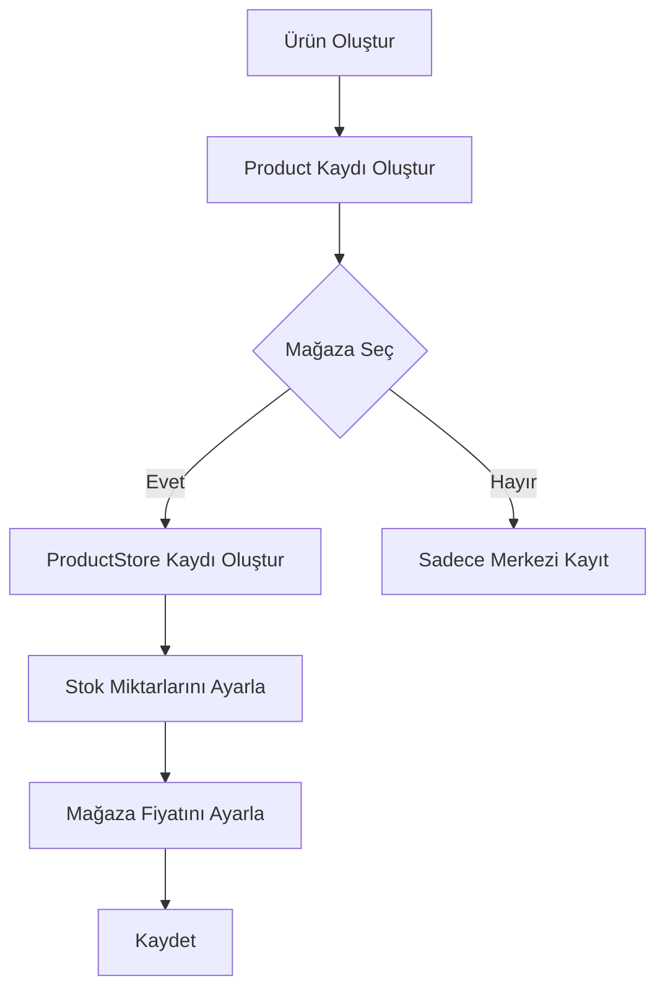
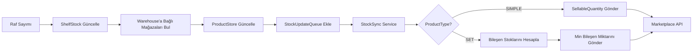
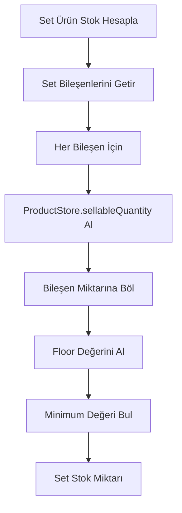

# Ürünler ve Mağaza'ya Bağlı Ürünler Mimarisi

## Genel Bakış

Bu sistem, çoklu mağaza (multi-store) ve çoklu pazaryeri (marketplace) yönetimi için tasarlanmış bir ürün-stok yönetim mimarisidir. Temel olarak bir ürünün merkezi tanımı ve her mağaza/pazaryeri için spesifik stok/fiyat bilgilerini ayrı tutar.

## Veritabanı Yapısı

### 1. Product (Ürün) - Merkezi Ürün Tanımı

**Tablo:** `products`

**Amaç:** Ürünün merkezi, mağazadan bağımsız tanımı

| Alan | Tip | Açıklama |
|------|-----|----------|
| `id` | uuid | Birincil anahtar |
| `name` | varchar(255) | Ürün adı |
| `brandId` | uuid | Marka referansı (opsiyonel) |
| `categoryId` | uuid | Kategori referansı (zorunlu) |
| `barcode` | varchar(255) | Barkod (benzersiz) |
| `sku` | varchar(255) | Stok Kodu |
| `productType` | enum | SIMPLE veya SET |
| `vatRate` | int | KDV oranı (varsayılan: %20) |
| `desi` | int | Desi değeri |
| `purchasePrice` | decimal | Alış fiyatı |
| `averageCost` | decimal | Ağırlıklı ortalama maliyet |
| `salePrice` | decimal | Satış fiyatı (referans) |
| `setPrice` | decimal | Set ürün fiyatı (sadece SET tipi için) |
| `lastSalePrice` | decimal | Son satış fiyatı |
| `isActive` | boolean | Aktif mi? |

**İlişkiler:**
- `productStores` → OneToMany ile ProductStore
- `brand` → ManyToOne ile Brand
- `category` → ManyToOne ile Category

### 2. ProductStore (Ürün-Mağaza İlişkisi)

**Tablo:** `product_stores`

**Amaç:** Bir ürünün belirli bir mağazadaki stok, fiyat ve durum bilgilerini tutar

| Alan | Tip | Açıklama |
|------|-----|----------|
| `id` | uuid | Birincil anahtar |
| `productId` | uuid | Ürün referansı |
| `storeId` | uuid | Mağaza referansı |
| `storeSku` | varchar(255) | Mağaza spesifik SKU |
| `storeBarcode` | varchar(255) | Mağaza spesifik barkod |
| `storeSalePrice` | decimal | Mağaza satış fiyatı (Product.salePrice'ı ezer) |
| `stockQuantity` | int | Fiziksel stok miktarı |
| `sellableQuantity` | int | Satılabilir stok (Physical - Committed) |
| `reservableQuantity` | int | Rezerve edilebilir stok |
| `committedQuantity` | int | Siparişlere ayrılmış stok |
| `isActive` | boolean | Bu mağazada aktif mi? |

**Benzersiz Kısıt:** `(productId, storeId)` - Bir ürün bir mağazada sadece bir kez tanımlanabilir

**İlişkiler:**
- `product` → ManyToOne ile Product (CASCADE delete)
- `store` → ManyToOne ile Store (CASCADE delete)

### 3. ProductSetItem (Set Ürün Bileşenleri)

**Tablo:** `product_set_items`

**Amaç:** SET tipi ürünlerin hangi basit ürünlerden oluştuğunu tanımlar

| Alan | Tip | Açıklama |
|------|-----|----------|
| `id` | uuid | Birincil anahtar |
| `setProductId` | uuid | Set ürün referansı |
| `componentProductId` | uuid | Bileşen ürün referansı |
| `quantity` | int | Set içindeki miktar (varsayılan: 1) |
| `priceShare` | decimal | Fatura için fiyat payı |
| `sortOrder` | int | Görüntüleme sırası |

## Stok Miktarları Formülleri

### Temel Formüller

```
sellableQuantity = stockQuantity - committedQuantity
reservableQuantity = sellableQuantity
```

### Sipariş Oluştururken (Stok Ayırma)

```
committedQuantity += sipariş_miktarı
sellableQuantity -= sipariş_miktarı
```

### Sipariş Paketlendiğinde (Stok Düşme)

```
stockQuantity -= paketlenen_miktar
committedQuantity -= paketlenen_miktar
```

### Raf Stok Güncellemesi

Raf sayımından sonra:
```
stockQuantity = toplam_raf_miktarı
sellableQuantity = max(0, fiziksel_satılabilir - committedQuantity)
reservableQuantity = fiziksel_satılabilir
```

## İş Akışları

### 1. Ürün Oluşturma İş Akışı



### 2. Stok Senkronizasyon İş Akışı



### 3. Set Ürün Stok Hesaplama



## Servis Katmanı

### ProductsService

**Dosya:** `apps/api/src/products/products.service.ts`

**Temel Metotlar:**
- `create()` - Yeni ürün oluşturur
- `findAll()` - Ürünleri listeler (storeId filtresi destekler)
- `findByBarcode()` - Barkod ile ürün bulur
- `update()` - Ürün günceller
- `importExcel()` - Excel'den toplu ürün importu
- `addStockWithCost()` - Ağırlıklı ortalama maliyet hesaplama

### ProductStoresService

**Dosya:** `apps/api/src/product-stores/product-stores.service.ts`

**Temel Metotlar:**
- `create()` - Yeni ürün-mağaza ilişkisi oluşturur
- `findAll()` - ProductStore kayıtlarını listeler
- `update()` - Stok/fiyat günceller
- `findByStoreBarcode()` - Mağaza barkodu ile bulur
- `bulkUpsert()` - Toplu oluştur/güncelle

### StockSyncService

**Dosya:** `apps/api/src/stock-sync/stock-sync.service.ts`

**Temel Metotlar:**
- `processQueue()` - Stok güncelleme kuyruğunu işler
- `calculateSetStock()` - Set ürün için kullanılabilir miktar hesaplar
- `sendToMarketplace()` - Pazaryeri API'sine gönderir

## API Endpoint'leri

### Products Controller

| Endpoint | Method | Açıklama |
|----------|--------|----------|
| `/products` | GET | Ürünleri listeler |
| `/products/:id` | GET | Ürün detayı |
| `/products` | POST | Yeni ürün |
| `/products/:id` | PATCH | Ürün güncelle |
| `/products/:id` | DELETE | Ürün sil |
| `/products/import` | POST | Excel import |
| `/products/template` | GET | Excel şablonu indir |

### ProductStores Controller

| Endpoint | Method | Açıklama |
|----------|--------|----------|
| `/product-stores` | GET | Ürün-mağaza listesi |
| `/product-stores/:id` | GET | Detay |
| `/product-stores` | POST | Yeni ilişki |
| `/product-stores/:id` | PATCH | Güncelle |
| `/product-stores/:id` | DELETE | Sil |
| `/product-stores/bulk-upsert` | POST | Toplu oluştur/güncelle |

## Önemli Notlar

### 1. Mağaza Türleri

- **TRENDYOL** - Trendyol pazaryeri
- **HEPSIBURADA** - Hepsiburada pazaryeri
- **IKAS** - İKAS e-ticaret platformu
- **MANUAL** - Manuel mağaza (fiziksel mağaza)

### 2. Stok Güncelleme Senkronizasyonu

Stok değişiklikleri otomatik olarak `stock_update_queue` tablosuna eklenir ve arka planda çalışan `StockSyncService` tarafından pazaryerlerine gönderilir.

### 3. Set Ürünler

Set ürünlerin stok miktarı, bileşenlerinin en az stoklu olanına göre hesaplanır. Örneğin:
- Set: 1 Tişört + 1 Pantolon
- Tişört stok: 50
- Pantolon stok: 30
- Set stok: min(50, 30) = 30

### 4. Fiyat Önceliği

1. `ProductStore.storeSalePrice` (en yüksek öncelik)
2. `Product.salePrice` (varsayılan)

### 5. Cascade Delete

- Bir Product silinirse → bağlı ProductStore kayıtları da silinir
- Bir Store silinirse → bağlı ProductStore kayıtları da silinir
- Bir ProductSetItem silinirse → CASCADE ile silinir

## Veri Örnekleri

### Product Örneği

```json
{
  "id": "550e8400-e29b-41d4-a716-446655440000",
  "name": "Nike Tişört",
  "brandId": "brand-uuid",
  "categoryId": "category-uuid",
  "barcode": "8690000000001",
  "sku": "NKE-TSHIRT-001",
  "productType": "SIMPLE",
  "vatRate": 20,
  "salePrice": 599.90,
  "isActive": true
}
```

### ProductStore Örneği

```json
{
  "id": "ps-uuid",
  "productId": "550e8400-e29b-41d4-a716-446655440000",
  "storeId": "store-uuid",
  "storeSku": "NKE-TSHIRT-TRENDYOL",
  "storeBarcode": "8690000000001",
  "storeSalePrice": 649.90,
  "stockQuantity": 100,
  "sellableQuantity": 85,
  "reservableQuantity": 85,
  "committedQuantity": 15,
  "isActive": true
}
```

### ProductSetItem Örneği

```json
{
  "id": "psi-uuid",
  "setProductId": "set-product-uuid",
  "componentProductId": "component-uuid",
  "quantity": 1,
  "priceShare": 299.95,
  "sortOrder": 1
}
```

## İlgili Dosyalar

| Dosya | Açıklama |
|-------|----------|
| `apps/api/src/products/entities/product.entity.ts` | Product entity |
| `apps/api/src/product-stores/entities/product-store.entity.ts` | ProductStore entity |
| `apps/api/src/products/entities/product-set-item.entity.ts` | ProductSetItem entity |
| `apps/api/src/stores/entities/store.entity.ts` | Store entity |
| `apps/api/src/products/products.service.ts` | Products servisi |
| `apps/api/src/product-stores/product-stores.service.ts` | ProductStores servisi |
| `apps/api/src/stock-sync/stock-sync.service.ts` | Stok senkronizasyon servisi |
| `apps/api/src/shelves/shelves.service.ts` | Raf ve stok yönetimi servisi |
