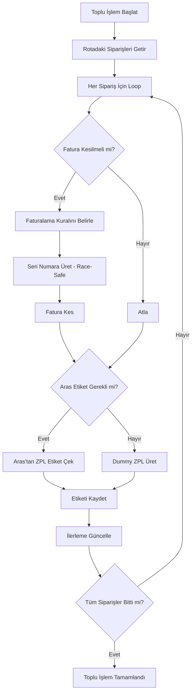

# Rota Toplu İşlem Özelliği Planı

> **DURUM: ✅ TAMAMLANDI (2026-01-25)**
>
> Tüm plan kısımları uygulanmış ve test edilmeye hazır. Aşağıdaki özellikler çalışır durumda:
> - Backend: `bulkProcessOrders()`, `fetchArasLabel()`, controller endpoints
> - Frontend: `bulkProcessRoute()`, `getRouteLabelsZpl()`, UI butonları ve modal
>
> **Kullanım:** Rota detay sayfası → READY durumu → "Toplu Faturalama ve Etiketleme" butonu

## Genel Bakış

Rotadaki tüm siparişleri tek seferde işlemek için toplu işlem özelliği eklenmesi planlanıyor.

## Durum (Güncelleme: 2026-01-25)

**Mevcut Durum:** Planın bir kısmı zaten uygulanmış durumda.

### Tamamlanan Kısımlar:
- [`routes.service.ts`](apps/api/src/routes/routes.service.ts:683-784) içinde [`bulkProcessOrders()`](apps/api/src/routes/routes.service.ts:683) metodu mevcut
- [`getAllLabelsZpl()`](apps/api/src/routes/routes.service.ts:820) metodu mevcut
- [`generateDummyZplWithInvoice()`](apps/api/src/routes/routes.service.ts:800) metodu mevcut
- [`ArasKargoService`](apps/api/src/stores/providers/aras-kargo.service.ts:197-270) içinde [`getBarcode()`](apps/api/src/stores/providers/aras-kargo.service.ts:197) metodu mevcut
- [`InvoicesService`](apps/api/src/invoices/invoices.service.ts:177) içinde [`createInvoiceFromOrder()`](apps/api/src/invoices/invoices.service.ts:177) metodu mevcut ve faturalama kuralları uygulanmı��

### Eksik Kısımlar:
1. **Controller endpoints**: [`routes.controller.ts`](apps/api/src/routes/routes.controller.ts) içinde yeni endpoint'ler eksik
2. **Aras entegrasyonu**: [`bulkProcessOrders()`](apps/api/src/routes/routes.service.ts:683) içinde Aras'tan ZPL çekme eksik
3. **Database alanları**: Route ve Order entity'lerine yeni alanlar eklenmeli
4. **Frontend**: [`RouteDetailClient.tsx`](apps/web/src/app/routes/[id]/RouteDetailClient.tsx) içinde UI eksik

## Kullanım Senaryosu

1. Kullanıcı bir rota oluşturur
2. Rotaya siparişler eklenir
3. Rota detay sayfasında "Toplu İşlem Başlat" butonu görünür
4. Butona tıklandığında arka planda işlemler başlar:
   - Faturala kesmeler
   - Aras Kargo etiketlerini çekme
   - Her işlem için ilerleme takibi
5. İşlemler tamamlandığında "Barkodları Yazdır" butonu aktif olur
6. Tüm ZPL etiketlerini toplu yazdırma

## Faturalama Kuralları Analizi

### 1. Trendyol Mikro İhracat (Micro Export)
**Şart:** `order.micro === true && store.hasMicroExport && store.type === 'TRENDYOL'`

```
vknTckn: '11111111111' (sabit)
cardCode: 'TRENDYOL {CountryCode}' (örn: TRENDYOL TR, TRENDYOL AZ)
accountCode: 
  - Eğer AZ ise -> store.microExportAzAccountCode
  - Değilse -> store.microExportAccountCode
serialNo: store.microExportEArchiveSerialNo
edocNo: generateInvoiceNumber(serialNo) // DB'den max + 1
docTraCode: store.microExportTransactionCode || store.invoiceTransactionCode
```

### 2. E-Fatura (E-Invoice)
**Şart:** `isEInvoiceUser(customer.taxNumber || customer.tcIdentityNumber) === true`

```
vknTckn: cleanTaxId (müşterinin gerçek vergi numarası)
cardCode: store.eInvoiceCardCode (1'er arttırılarak)
accountCode:
  - Eğer IKAS && HAVALE ise -> store.eInvoiceHavaleAccountCode
  - Değilse -> store.eInvoiceAccountCode
serialNo: store.eInvoiceSerialNo
edocNo: generateInvoiceNumber(serialNo) // DB'den max + 1
docTraCode: store.invoiceTransactionCode
isEInvoice: true

NOT: E-fatura kullanıcısı için Uyumsoft'a cari kart açma/güncelleme (insertEntity)
```

### 3. E-Arşiv (E-Archive)
**Şart:** E-fatura kullanıcısı DEĞİLSE

```
vknTckn: '11111111111' (sabit)
cardCode:
  - Eğer IKAS && HAVALE ise -> store.eArchiveHavaleCardCode
  - Değilse -> store.eArchiveCardCode
accountCode:
  - Eğer IKAS && HAVALE ise -> store.eArchiveHavaleAccountCode
  - Değilse -> store.eArchiveAccountCode
serialNo: store.eArchiveSerialNo
edocNo: generateInvoiceNumber(serialNo) // DB'den max + 1
docTraCode: store.invoiceTransactionCode
isEInvoice: false
```

## Seri Numara (Invoice Number) Üretimi

`generateInvoiceNumber(serialNo)` metodu:
1. DB'den max invoice number'ı çeker (örn: EMA2026000016935)
2. Sayıyı 1 artırır
3. Return: `${serialNo}${yeni_numara}` (örn: EMA2026000016936)

**Race Condition Koruması:**
```sql
-- Transaction kullan
BEGIN TRANSACTION;
SELECT MAX(edocNo) FROM invoices WHERE serialNo = ? FOR UPDATE;
-- Numara artır
-- Invoice oluştur
COMMIT;
```

## Toplu İşlem Akışı

### Backend Workflow



### API Endpoints

#### 1. POST `/api/routes/:id/bulk-process`
**İstek:**
```typescript
{
  // İhtiyaç yoksa boş bırakılabilir
}
```

**Response:**
```typescript
{
  success: true,
  data: {
    jobId: string,  // Job takibi için
    totalOrders: number,
  }
}
```

#### 2. GET `/api/routes/:id/bulk-process/status`
**Response:**
```typescript
{
  success: true,
  data: {
    status: 'PENDING' | 'PROCESSING' | 'COMPLETED' | 'FAILED',
    processed: number,
    total: number,
    errors: string[],
    results: {
      orderId: string,
      orderNumber: string,
      invoiceCreated: boolean,
      invoiceNumber?: string,
      labelFetched: boolean,
      labelType: 'aras' | 'dummy',
      error?: string,
    }[]
  }
}
```

#### 3. GET `/api/routes/:id/labels/print`
**Response:**
```typescript
{
  success: true,
  data: {
    zplContent: string,  // Tüm ZPL'ler birleştirilmiş
    orderCount: number,
  }
}
```

### Database Schema

**BulkProcessJob Entity:**
```typescript
{
  id: UUID,
  routeId: UUID,
  status: 'PENDING' | 'PROCESSING' | 'COMPLETED' | 'FAILED',
  totalOrders: number,
  processedOrders: number,
  startedAt: Date,
  completedAt?: Date,
  results: JSON,  // Order ID -> Result mapping
  errors: string[],
}
```

**Order Entity Güncellemesi:**
```typescript
{
  ...existingFields,
  zplLabel?: string,  // ZPL etiket içeriği
  labelType?: 'aras' | 'dummy',
  labelFetchedAt?: Date,
}
```

## Frontend Implementation

### Rota Detay Sayfası Güncellemeleri

#### 1. Toplu İşlem Butonu
```tsx
{!route.bulkProcessCompleted && (
  <Button onClick={handleBulkProcess} disabled={processing}>
    {processing ? (
      <>
        <Loader2 className="animate-spin mr-2" />
        İşleniyor... ({processedCount}/{totalCount})
      </>
    ) : (
      <>
        <FileText className="mr-2" />
        Toplu İşlem Başlat
      </>
    )}
  </Button>
)}
```

#### 2. İlerleme Göstergesi
```tsx
{processing && (
  <Card>
    <CardContent>
      <div className="space-y-2">
        <Progress value={(processedCount / totalCount) * 100} />
        <p>{processedCount} / {totalCount} sipariş işlendi</p>
        {errors.length > 0 && (
          <Alert variant="destructive">
            <AlertTitle>Hatalar</AlertTitle>
            <ul>
              {errors.map((error, i) => <li key={i}>{error}</li>)}
            </ul>
          </Alert>
        )}
      </div>
    </CardContent>
  </Card>
)}
```

#### 3. Barkodları Yazdır Butonu
```tsx
{route.bulkProcessCompleted && (
  <Button onClick={handlePrintLabels}>
    <Printer className="mr-2" />
    Barkodları Yazdır ({labelCount} adet)
  </Button>
)}
```

## Toplu İşlem Fatura Yönetimi

### Sıralı İşlem (Sequential Processing)

Toplu işlemde siparişler **sırayla** işlendiği için lock'a gerek yok:

```typescript
for (const order of orders) {
  // 1. Faturalama kuralını belirle
  const invoiceSettings = await this.determineInvoiceSettings(order);
  
  // 2. Fatura numarası üret (getMaxNumber - mevcut sistemdeki gibi)
  const invoiceNumber = await this.generateInvoiceNumber(invoiceSettings.serialNo);
  
  // 3. Faturayı PENDING'e KOYMA - direkt oluştur!
  // Çünkü dummy HTML'de fatura numarası görünmeli
  const invoice = await this.invoicesService.createInvoiceFromOrder(order.id, {
    ...invoiceSettings,
    invoiceNumber,
  });
  
  // 4. Sipariş için invoice bilgisini kaydet
  order.invoiceId = invoice.id;
  order.invoiceNumber = invoice.invoiceNumber;
}
```

### E-Fatura Card Code Artırma

E-Fatura için card code sırayla artırılacak (mevcut sistemle uyumlu):

```typescript
// Her E-fatura için store'daki eInvoiceCardCode'u artır
if (isEInvoice) {
  const currentCardCode = store.eInvoiceCardCode;
  // Kullan
  invoice.cardCode = currentCardCode;
  // Sonraki için artır
  await this.storeRepository.update(store.id, {
    eInvoiceCardCode: String(parseInt(currentCardCode) + 1)
  });
}
```

## Önemli Notlar

1. **Mevcut sistemi bozmama:** Tek sipariş işlemleri aynı çalışmaya devam edecek
2. **Background job:** Toplu işlem arka planda çalışacak, kullanıcı beklemeyecek
3. **Progress tracking:** Real-time ilerleme takibi
4. **Error handling:** Her sipariş için ayrı hata yönetimi, bir siparişteki hata diğerlerini etkilemeyecek
5. **ZPL Storage:** Etiketler DB'de saklanacak, toplu yazdırma için
6. **Atomic operations:** Transaction kullanarak race condition'ları önle

## Test Senaryoları

1. **10 sipariş (hepsi E-Arşiv)** → Aynı serial'den sıralı numara
2. **5 E-Fatura + 5 E-Arşiv** → İki farklı serial, her birinden sıralı
3. **Race condition testi:** 2 route'u paralel işleme → Numara çakışmaması
4. **Aras etiketi başarısız** → Dummy etiket kullanımı
5. **Bir siparişte hata** → Diğerleri işlenmeye devam etmeli

---

## YENİ MİMARİ: Fatura Kuyruk Sistemi (Asenkron Faturalama)

### Problem

Fatura kesme işlemi Uyumsoft API çağrısı gerektirdiği için zaman alabilir. Paketleme ekranında kullanıcı paketi hızlıca çıkarmak ister, fatura kesme işleminin tamamlanmasını beklemek istemez.

### Çözüm: Asenkron Fatura Kuyruğu

Fatura kesme işlemini iki aşamaya ayır:

1. **Hazırlık Aşaması (Senkron, Hızlı):**
   - Fatura kurallarını belirle
   - `edocNo` (fatura numarası) üret ve ayır
   - Invoice kaydını `PENDING` statüsünde oluştur
   - Kullanıcıya hemen dön

2. **İşleme Aşaması (Asenkron, Arka Plan):**
   - 5 dakikada bir çalışan job/service
   - PENDING faturaları toplu işler
   - Uyumsoft'a gönderir
   - Başarılı olursa `SUCCESS` durumuna çeker

### Akış Diyagramı

```mermaid
graph TD
    subgraph "Paketleme Ekranı"
        A[Siparişi Tamamla] --> B{Fatura Gerekli mi?}
        B -->|Evet| C[queueInvoiceForProcessing]
        C --> D[edocNo Üret ve Ayır]
        D --> E[Invoice PENDING Kaydet]
        E --> F[Hızlı ZPL Dummy Al]
        F --> G[Paketi Çıkar]
    end
    
    subgraph "Arka Plan Job (5dk'da bir)"
        H[InvoiceProcessorService] --> I[PENDING Faturaları Getir]
        I --> J[Her Fatura İçin]
        J --> K[Uyumsoft'a Gönder]
        K --> L{Başarılı mı?}
        L -->|Evet| M[Invoice SUCCESS]
        L -->|Hayır| N[Invoice ERROR]
        M --> O[Order INVOICED]
    end
    
    subgraph "Toplu Faturalama"
        P[Toplu İşlem Başlat] --> Q[queueInvoiceForProcessing]
        Q --> R[edocNo Üret ve Ayır]
        R --> S[Invoice PENDING Kaydet]
        S --> T[Aras'tan ZPL Al]
        T --> U[Sonraki Sipariş]
    end
```



### Database Schema Güncellemesi

**Invoice Entity** (zaten mevcut, kullanılacak):
```typescript
{
    id: UUID,
    orderId: UUID,
    invoiceNumber: string,  // edocNo - önceden üretilmiş
    status: InvoiceStatus.PENDING,  // Başlangıç durumu
    requestPayload: JSON,  // Uyumsoft payload hazır
    responsePayload: JSON, // İşlem sonrası dolacak
    errorMessage: string,
    processedAt: Date,
}
```

### API Metodları

#### 1. InvoicesService.queueInvoiceForProcessing()

```typescript
/**
 * Fatura için numara ayır ve PENDING kayıt oluştur
 * Bu metod hızlı çalışır, Uyumsoft'a göndermez
 */
async queueInvoiceForProcessing(orderId: string): Promise<Invoice> {
    // 1. Order'ı getir
    const order = await this.orderRepository.findOne({
        where: { id: orderId },
        relations: ['store', 'customer'],
    });

    // 2. Fatura kurallarını belirle (mevcut mantık)
    const invoiceSettings = await this.determineInvoiceSettings(order);
    
    // 3. Fatura numarası üret ve ayır (race-safe)
    const invoiceNumber = await this.generateInvoiceNumber(invoiceSettings.serialNo);
    
    // 4. Uyumsoft payload'ını hazırla (gönderme)
    const requestPayload = await this.buildUyumsoftPayload(order, {
        ...invoiceSettings,
        invoiceNumber,
    });
    
    // 5. PENDING invoice kaydı oluştur
    const invoice = this.invoiceRepository.create({
        orderId: order.id,
        invoiceNumber,
        invoiceSerial: invoiceSettings.serialNo,
        status: InvoiceStatus.PENDING,
        requestPayload,
        // Diğer alanlar...
    });
    
    return await this.invoiceRepository.save(invoice);
}
```

#### 2. InvoiceProcessorService (YENİ)

```typescript
@Injectable()
export class InvoiceProcessorService {
    private readonly logger = new Logger(InvoiceProcessorService.name);
    
    constructor(
        private readonly invoicesService: InvoicesService,
        private readonly invoiceRepository: Repository<Invoice>,
    ) {}

    /**
     * 5 dakikada bir çalışacak job
     * Tüm PENDING faturaları işler
     */
    async processPendingInvoices(): Promise<void> {
        const pendingInvoices = await this.invoiceRepository.find({
            where: { status: InvoiceStatus.PENDING },
            take: 50,  // Batch size
            order: { createdAt: 'ASC' },
        });

        this.logger.log(`Processing ${pendingInvoices.length} pending invoices`);

        for (const invoice of pendingInvoices) {
            try {
                await this.processSingleInvoice(invoice);
            } catch (error) {
                this.logger.error(`Failed to process invoice ${invoice.id}: ${error.message}`);
                // Hata durumunda ERROR statüsüne çek
                await this.invoiceRepository.update(invoice.id, {
                    status: InvoiceStatus.ERROR,
                    errorMessage: error.message,
                });
            }
        }
    }

    /**
     * Tek faturayı Uyumsoft'a gönder
     */
    private async processSingleInvoice(invoice: Invoice): Promise<void> {
        // Uyumsoft'a gönder
        const response = await this.invoicesService.sendToUyumsoft(invoice.requestPayload);
        
        // Güncelle
        await this.invoiceRepository.update(invoice.id, {
            status: InvoiceStatus.SUCCESS,
            responsePayload: response,
            ettn: response?.ettn,
            uyumsoftInvoiceId: response?.invoiceId,
            processedAt: new Date(),
        });

        // Order'ı INVOICED durumuna çek
        await this.orderRepository.update(invoice.orderId, {
            status: OrderStatus.INVOICED,
        });
    }
}
```

#### 3. Schedule Job (app.module.ts veya ayrı modül)

```typescript
import { ScheduleModule } from '@nestjs/schedule';

@Module({
    imports: [
        ScheduleModule.forRoot(),
        // ...
    ],
    providers: [
        InvoiceProcessorService,
        // Cron job tanımı
        {
            provide: 'INVOICE_PROCESSOR_JOB',
            useFactory: (service: InvoiceProcessorService) => {
                return setInterval(() => {
                    service.processPendingInvoices();
                }, 5 * 60 * 1000);  // 5 dakika
            },
            inject: [InvoiceProcessorService],
        },
    ],
})
export class AppModule {}
```

### Güncellemeler Gereken Servisler

#### PackingService.completeOrder()

```typescript
async completeOrder(orderId: string) {
    // ... mevcut kodlar ...
    
    // Fatura gerekli mi?
    if (order.documentType === 'INVOICE') {
        // Kuyruğa ekle (hızlı)
        await this.invoicesService.queueInvoiceForProcessing(orderId);
    }
    
    // ZPL etiket al (dummy veya Aras)
    const zpl = await this.getQuickZpl(order);
    
    // Paketi çıkar
    // ...
}
```

#### RoutesService.bulkProcessOrders()

```typescript
async bulkProcessOrders(routeId: string) {
    // ... mevcut kodlar ...
    
    for (const order of orders) {
        // Fatura kuyruğa ekle (hızlı)
        if (order.documentType === 'INVOICE') {
            await this.invoicesService.queueInvoiceForProcessing(order.id);
            orderResult.invoiceCreated = true;
            // invoiceNumber daha sonra belirlenecek
        }
        
        // ZPL etiket al (dummy veya Aras)
        // ...
    }
}
```

### Avantajları

1. **Hız:** Paketleme ekranı fatura kesmeyi beklemez
2. **Ölçeklenebilirlik:** Arka planda toplu işleme
3. **Dayanıklılık:** Uyumsoft hata verirse tekrar denenebilir
4. **İzlenebilirlik:** PENDING → SUCCESS/ERROR durum takibi

### Test Senaryoları

1. **Paketleme:** Sipariş tamamla → PENDING invoice → 5dk sonra SUCCESS
2. **Toplu İşlem:** 10 sipariş → 10 PENDING invoice → Job hepsini işler
3. **Hata Yönetimi:** Uyumsoft hata verirse ERROR durumuna çeker, manuel retry

---

## KRİTİK: Race Condition ve Lock Stratejisi

### Problem

Aynı anda birden fazla paketleme işlemi yapıldığında, aynı `serialNo` için fatura numarası üretimi race condition'a neden olabilir:

```
Paketleyici A: getMaxNumber(EMA2026...) → 16935
Paketleyici B: getMaxNumber(EMA2026...) → 16935  (A henüz kaydetmedi)
Paketleyici A: insertInvoice(EMA2026000016936)
Paketleyici B: insertInvoice(EMA2026000016936)  ❌ DUPLICATE!
```

### Çözüm Seçenekleri

#### Seçenek 1: Database Row-Level Lock (ÖNERİLEN)

```typescript
// generateInvoiceNumber metodunda
async generateInvoiceNumber(serialNo: string): Promise<string> {
    return await this.invoiceRepository.manager.transaction(async (transactionalEntityManager) => {
        // FOR UPDATE ile satırı kilitle
        const result = await transactionalEntityManager
            .createQueryBuilder(Invoice, 'invoice')
            .select('MAX(invoice.edocNo)', 'maxNumber')
            .where('invoice.edocNo LIKE :prefix', { prefix: `${serialNo}%` })
            .setLock('pessimistic_write')  // Postgres: FOR UPDATE
            .getRawOne();

        const maxNumber = result?.maxNumber || `${serialNo}0000000000000`;
        const numericPart = parseInt(maxNumber.replace(serialNo, ''), 10) || 0;
        const newNumber = numericPart + 1;
        const paddedNumber = String(newNumber).padStart(13, '0');
        
        return `${serialNo}${paddedNumber}`;
    });
}
```

**Avantajları:**
- Database seviyesinde garanti
- Distributed lock'a gerek yok
- Mevcut kod yapısına uygun

**Dezavantajları:**
- Transaction süresince satır kilitli (kısa süre)

#### Seçenek 2: Redis Distributed Lock

```typescript
async generateInvoiceNumber(serialNo: string): Promise<string> {
    const lockKey = `invoice:lock:${serialNo}`;
    const lockValue = Date.now().toString();
    
    // Lock al (5 saniye timeout)
    const acquired = await redis.set(lockKey, lockValue, 'PX', 5000, 'NX');
    if (!acquired) {
        throw new ConflictException('Fatura numarası üretiliyor, lütfen tekrar deneyin');
    }
    
    try {
        // Fatura numarası üret
        // ...
        return invoiceNumber;
    } finally {
        // Lock bırak (sadece sahibi)
        await redis.eval(`
            if redis.call("get", KEYS[1]) == ARGV[1] then
                return redis.call("del", KEYS[1])
            else
                return 0
            end
        `, 1, lockKey, lockValue);
    }
}
```

**Avantajları:**
- Daha esnek
- Timeout ile deadlock önleme

**Dezavantajları:**
- Redis bağımlılığı
- Ek altyapı

#### Seçenek 3: Application-Level Mutex (Basit)

```typescript
// InvoicesService içinde
private locks = new Map<string, Promise<any>>();

async generateInvoiceNumber(serialNo: string): Promise<string> {
    // Mevcut işlem varsa bekle
    let existingLock = this.locks.get(serialNo);
    if (existingLock) {
        await existingLock;
    }
    
    // Yeni lock oluştur
    const lockPromise = (async () => {
        try {
            // Fatura numarası üret
            // ...
            return invoiceNumber;
        } finally {
            this.locks.delete(serialNo);
        }
    })();
    
    this.locks.set(serialNo, lockPromise);
    return lockPromise;
}
```

**Avantajları:**
- Basit implementasyon
- Ek bağımlılık yok

**Dezavantajları:**
- Sadece tek instance için çalışır
- Server restart'ta kaybolur

### ÖNERİ: Seçenek 1 (Database Row-Level Lock)

Neden:
1. Mevcut sistemde zaten TypeORM transaction kullanılıyor
2. Distributed lock'a gerek yok
3. Database seviyesinde garanti
4. Paketleme işlemleri genelde aynı instance'ten yapılıyor

### Implementasyon

```typescript
// invoices.service.ts
async generateInvoiceNumber(serialNo: string): Promise<string> {
    // QueryRunner ile transaction
    const queryRunner = this.invoiceRepository.createQueryRunner();
    await queryRunner.connect();
    await queryRunner.startTransaction();
    
    try {
        // FOR UPDATE ile kilitle
        const result = await queryRunner.manager
            .createQueryBuilder(Invoice, 'invoice')
            .select('MAX(invoice.edocNo)', 'maxNumber')
            .where('invoice.edocNo LIKE :prefix', { prefix: `${serialNo}%` })
            .setLock('pessimistic_write')
            .getRawOne();

        const maxNumber = result?.maxNumber || `${serialNo}0000000000000`;
        const numericPart = parseInt(maxNumber.replace(serialNo, ''), 10) || 0;
        const newNumber = numericPart + 1;
        const paddedNumber = String(newNumber).padStart(13, '0');
        const invoiceNumber = `${serialNo}${paddedNumber}`;
        
        await queryRunner.commitTransaction();
        return invoiceNumber;
    } catch (error) {
        await queryRunner.rollbackTransaction();
        throw error;
    } finally {
        await queryRunner.release();
    }
}
```

---

## Uygulama Planı (İmplementasyon Adımları)

### Adım 1: Backend Controller Endpoints

[`routes.controller.ts`](apps/api/src/routes/routes.controller.ts) dosyasına aşağıdaki endpoint'leri ekle:

```typescript
@Post(':id/bulk-process')
async bulkProcess(
    @Param('id', ParseUUIDPipe) id: string,
    @CurrentUser() user: JwtPayload,
) {
    const result = await this.routesService.bulkProcessOrders(id, user?.sub);
    return {
        success: true,
        data: result,
    };
}

@Get(':id/labels/print')
async printAllLabels(@Param('id', ParseUUIDPipe) id: string) {
    const labels = await this.routesService.getAllLabelsZpl(id);
    return {
        success: true,
        data: labels,
    };
}
```

### Adım 2: Aras Entegrasyonunu bulkProcessOrders'a Ekle

[`routes.service.ts`](apps/api/src/routes/routes.service.ts:750-760) içindeki etiket oluşturma kısmını güncelle:

```typescript
// B. Etiket oluştur - Aras'tan ZPL çek
if (!order.cargoLabelZpl) {
    // Önce Aras'tan deneyim
    const arasZpl = await this.fetchArasLabel(order);
    
    if (arasZpl) {
        // Aras başarılı
        await this.orderRepository.update(order.id, {
            cargoLabelZpl: arasZpl,
        });
        orderResult.labelType = 'aras';
    } else {
        // Aras başarısız, dummy oluştur
        const invoiceNum = await this.getInvoiceNumberForOrder(order.id);
        const dummyZpl = this.generateDummyZplWithInvoice(order, invoiceNum);
        await this.orderRepository.update(order.id, {
            cargoLabelZpl: dummyZpl,
        });
        orderResult.labelType = 'dummy';
    }
}
orderResult.labelFetched = true;
```

Yeni metod:
```typescript
private async fetchArasLabel(order: Order): Promise<string | null> {
    try {
        const integrationCode = order.orderNumber;
        return await this.arasKargoService.getBarcode(integrationCode);
    } catch (error) {
        this.logger.warn(`Aras label fetch failed for ${order.orderNumber}: ${error.message}`);
        return null;
    }
}
```

### Adım 3: Route Entity Güncelleme

[`route.entity.ts`](apps/api/src/routes/entities/route.entity.ts) dosyasına ekle:

```typescript
@Column({ name: 'bulk_process_completed', default: false })
bulkProcessCompleted: boolean;

@Column({ name: 'bulk_process_at', type: 'timestamp', nullable: true })
bulkProcessAt: Date | null;

@Column({ name: 'bulk_process_error_count', type: 'int', default: 0 })
bulkProcessErrorCount: number;
```

### Adım 4: Frontend API Fonksiyonları

[`lib/api.ts`](apps/web/src/lib/api.ts) dosyasına ekle:

```typescript
export interface BulkProcessResult {
    processed: number;
    total: number;
    errors: string[];
    results: Array<{
        orderId: string;
        orderNumber: string;
        invoiceCreated: boolean;
        invoiceNumber?: string;
        labelFetched: boolean;
        labelType?: 'aras' | 'dummy';
        error?: string;
    }>;
}

export async function bulkProcessRoute(routeId: string): Promise<ApiResponse<BulkProcessResult>> {
    return apiRequest(`/api/routes/${routeId}/bulk-process`, { method: 'POST' });
}

export async function printRouteLabels(routeId: string): Promise<ApiResponse<{ zplContent: string; orderCount: number }>> {
    return apiRequest(`/api/routes/${routeId}/labels/print`);
}
```

### Adım 5: Frontend UI Güncellemesi

[`RouteDetailClient.tsx`](apps/web/src/app/routes/[id]/RouteDetailClient.tsx:268-276) içindeki disabled butonu aktif hale getir:

```tsx
const [bulkProcessing, setBulkProcessing] = useState(false);
const [bulkProcessResult, setBulkProcessResult] = useState<BulkProcessResult | null>(null);

const handleBulkProcess = async () => {
    if (!confirm('Rotadaki tüm siparişler için fatura kesimi ve etiket oluşturma başlatılsın mı?')) return;
    
    setBulkProcessing(true);
    try {
        const result = await bulkProcessRoute(routeId);
        setBulkProcessResult(result.data);
        toast.success(`${result.data.processed}/${result.data.total} sipariş işlendi`);
        fetchRoute(); // Refresh route data
    } catch (err: any) {
        toast.error(err.message || 'Toplu işlem başarısız');
    } finally {
        setBulkProcessing(false);
    }
};

const handlePrintAllLabels = async () => {
    try {
        const result = await printRouteLabels(routeId);
        // ZPL yazıcıya gönder veya görüntüle
        const blob = new Blob([result.data.zplContent], { type: 'text/plain' });
        const url = URL.createObjectURL(blob);
        const a = document.createElement('a');
        a.href = url;
        a.download = `${route?.name || 'labels'}.zpl`;
        a.click();
        toast.success(`${result.data.orderCount} etiket indirildi`);
    } catch (err: any) {
        toast.error(err.message || 'Etiket indirme başarısız');
    }
};
```

Buton güncellemesi:
```tsx
<Button
    variant="secondary"
    className="w-full justify-start"
    onClick={handleBulkProcess}
    disabled={bulkProcessing || route.bulkProcessCompleted}
>
    {bulkProcessing ? (
        <>
            <Loader2 className="w-4 h-4 mr-2 animate-spin" />
            İşleniyor...
        </>
    ) : (
        <>
            <FileText className="w-4 h-4 mr-2" />
            Toplu Faturalama ve Etiketleme
        </>
    )}
</Button>

{route.bulkProcessCompleted && (
    <Button
        className="w-full justify-start bg-green-600 hover:bg-green-700"
        onClick={handlePrintAllLabels}
    >
        <Printer className="w-4 h-4 mr-2" />
        Tüm Etiketleri Yazdır
    </Button>
)}
```

### Adım 6: Migration (Opsiyonel)

Eğer yeni database alanları eklenecekse:

```bash
cd apps/api
npx typeorm migration:generate src/database/migrations/AddBulkProcessFieldsToRoutes -d src/database/data-source.ts
```

---

## Öncelik Sırası

1. **Yüksek:** Controller endpoint'lerini ekle (API çağrıları yapılabilir hale gelsin)
2. **Yüksek:** Aras entegrasyonunu bulkProcessOrders'a ekle
3. **Orta:** Frontend UI güncellemesi
4. **Düşük:** Entity ve migration (şimdilik mevcut alanlar yeterli, cargoLabelZpl zaten var)

---

## Notlar

- Mevcut [`bulkProcessOrders()`](apps/api/src/routes/routes.service.ts:683) metodu zaten çoğu işi yapıyor
- [`ArasKargoService.getBarcode()`](apps/api/src/stores/providers/aras-kargo.service.ts:197) metodu Aras'tan ZPL çekmeye hazır
- Order entity'de [`cargoLabelZpl`](apps/api/src/orders/entities/order.entity.ts) alanı zaten mevcut
