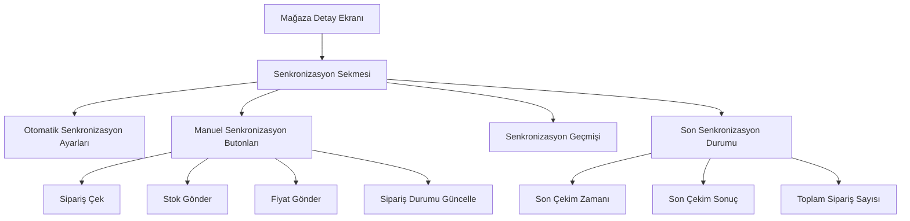

# Mağaza Detay Ekranı - Sipariş Senkronizasyon Özelliği Planı

## Mevcut Durum

### Mevcut Yapı

1. **OrderSyncService** - Arka planda çalışan cron job'lar:
   - Her 10 dakikada bir yeni siparişleri çeker
   - Her 15 dakikada bir sipariş durumlarını günceller

2. **SyncOrdersDialog** - Siparişler sayfasında manuel senkronizasyon dialog'u

3. **StoreDetailClient** - Mağaza detay ekranı:
   - API ayarları
   - Kargo ayarları
   - Senkronizasyon ayarları (crawlIntervalMinutes, sendStock, sendPrice, sendOrderStatus)
   - Fatura ayarları

### Sorun

- Mağaza detay ekranından pazaryerine bağlanıp sipariş çekme özelliği yok
- Kullanıcı mağaza ayarlarını düzenlerken aynı anda siparişleri de test edemiyor
- Senkronizasyon ayarları var ama manuel tetikleme yok

## Önerilen Çözüm

### Mağaza Detay Ekranına Eklenecek Özellikler

#### 1. Senkronizasyon Kontrol Paneli



#### 2. UI Tasarımı

```
┌─────────────────────────────────────────────────────────────────────────────┐
│ Mağaza: Embeauty Trendyol                                                    │
├─────────────────────────────────────────────────────────────────────────────┤
│                                                                             │
│  [Genel] [API] [Kargo] [Senkronizasyon] [Fatura] [Gönderen]                 │
│                                                                             │
│  ┌──────────────────────────────────���──────────────────────────────────┐   │
│  │ Otomatik Senkronizasyon                                              │   │
│  ├─────────────────────────────────────────────────────────────────────┤   │
│  │                                                                     │   │
│  │  [ ] Siparişleri Otomatik Çek                                       │   │
│  │  Aralık: [10] dakikada bir                                         │   │
│  │                                                                     │   │
│  │  [ ] Stok Bilgilerini Gönder                                        │   │
│  │  [ ] Fiyat Bilgilerini Gönder                                       │   │
│  │  [ ] Sipariş Durumunu Güncelle                                      │   │
│  │                                                                     │   │
│  └─────────────────────────────────────────────────────────────────────┘   │
│                                                                             │
│  ┌─────────────────────────────────────────────────────────────────────┐   │
│  │ Manuel Senkronizasyon                                               │   │
│  ├─────────────────────────────────────────────────────────────────────┤   │
│  │                                                                     │   │
│  │  [Sipariş Çek] [Stok Gönder] [Fiyat Gönder] [Durum Güncelle]        │   │
│  │                                                                     │   │
│  └─────────────────────────────────────────────────────────────────────┘   │
│                                                                             │
│  ┌─────────────────────────────────────────────────────────────────────┐   │
│  │ Son Senkronizasyon Durumu                                           │   │
│  ├─────────────────────────────────────────────────────────────────────┤   │
│  │                                                                     │   │
│  │  Son Sipariş Çekimi: 27.01.2026 21:30                               │   │
│  │  Durum: ✓ Başarılı                                                  │   │
│  │  Yeni Sipariş: 5 adet                                               │   │
│  │  İptal Edilen: 2 adet                                              │   │
│  │                                                                     │   │
│  │  Son Stok Gönderimi: 27.01.2026 21:25                               │   │
│  │  Durum: ✓ Başarılı                                                  │   │
│  │  Güncellenen Ürün: 120 adet                                         │   │
│  │                                                                     │   │
│  └─────────────────────────────────────────────────────────────────────┘   │
│                                                                             │
│  ┌─────────────────────────────────────────────────────────────────────┐   │
│  │ Senkronizasyon Geçmişi                                             │   │
│  ├─────────────────────────────────────────────────────────────────────┤   │
│  │                                                                     │   │
│  │  Tarih              İşlem              Durum    Sonuç               │   │
│  │  27.01.2026 21:30  Sipariş Çek        ✓        5 yeni, 2 iptal     │   │
│  │  27.01.2026 21:25  Stok Gönder        ✓        120 ürün            │   │
│  │  27.01.2026 21:20  Sipariş Çek        ✓        3 yeni              │   │
│  │  27.01.2026 21:15  Durum Güncelle     ✓        8 sipariş           │   │
│  │  27.01.2026 21:10  Sipariş Çek        ✗        Bağlantı hatası     │   │
│  │                                                                     │   │
│  │                              [Daha Fazla Göster]                    │   │
│  └─────────────────────────────────────────────────────────────────────┘   │
│                                                                             │
└─────────────────────────────────────────────────────────────────────────────┘
```

## API Değişiklikleri

### 1. Store Entity - Senkronizasyon Durumu Alanları

```typescript
@Entity('stores')
export class Store extends BaseEntity {
  // ... mevcut alanlar ...

  // Senkronizasyon Durumu
  @Column({ name: 'last_order_sync_at', type: 'timestamp', nullable: true })
  lastOrderSyncAt: Date;

  @Column({ name: 'last_order_sync_status', type: 'enum', enum: SyncStatus, nullable: true })
  lastOrderSyncStatus: SyncStatus;

  @Column({ name: 'last_order_sync_message', type: 'text', nullable: true })
  lastOrderSyncMessage: string;

  @Column({ name: 'last_stock_sync_at', type: 'timestamp', nullable: true })
  lastStockSyncAt: Date;

  @Column({ name: 'last_stock_sync_status', type: 'enum', enum: SyncStatus, nullable: true })
  lastStockSyncStatus: SyncStatus;

  @Column({ name: 'auto_sync_enabled', type: 'boolean', default: true })
  autoSyncEnabled: boolean;
}

enum SyncStatus {
  PENDING = 'PENDING',
  SUCCESS = 'SUCCESS',
  FAILED = 'FAILED',
  IN_PROGRESS = 'IN_PROGRESS',
}
```

### 2. Yeni Endpoint'ler

```typescript
// stores.controller.ts

@Post(':id/sync-orders')
async syncOrders(@Param('id') storeId: string) {
  // Manuel sipariş çekme
}

@Post(':id/sync-stock')
async syncStock(@Param('id') storeId: string) {
  // Manuel stok gönderme
}

@Post(':id/sync-prices')
async syncPrices(@Param('id') storeId: string) {
  // Manuel fiyat gönderme
}

@Post(':id/sync-status')
async syncOrderStatus(@Param('id') storeId: string) {
  // Manuel sipariş durumu güncelleme
}

@Get(':id/sync-history')
async getSyncHistory(@Param('id') storeId: string) {
  // Senkronizasyon geçmişi
}

@Post(':id/toggle-auto-sync')
async toggleAutoSync(@Param('id') storeId: string, @Body() body: { enabled: boolean }) {
  // Otomatik senkronizasyon aç/kapa
}
```

### 3. Senkronizasyon Log Tablosu

```typescript
@Entity('store_sync_logs')
export class StoreSyncLog extends BaseEntity {
  @Column({ name: 'store_id' })
  storeId: string;

  @Column({ name: 'sync_type', type: 'enum', enum: SyncType })
  syncType: SyncType;

  @Column({ name: 'status', type: 'enum', enum: SyncStatus })
  status: SyncStatus;

  @Column({ name: 'message', type: 'text', nullable: true })
  message: string;

  @Column({ type: 'jsonb', nullable: true })
  metadata: {
    ordersFetched?: number;
    ordersCancelled?: number;
    productsUpdated?: number;
    error?: string;
  };

  @Column({ name: 'started_at', type: 'timestamp' })
  startedAt: Date;

  @Column({ name: 'completed_at', type: 'timestamp', nullable: true })
  completedAt: Date;
}

enum SyncType {
  ORDERS = 'ORDERS',
  STOCK = 'STOCK',
  PRICES = 'PRICES',
  ORDER_STATUS = 'ORDER_STATUS',
}
```

## Frontend Değişiklikleri

### 1. StoreDetailClient.tsx - Yeni Sekme

```typescript
// Yeni tab: Senkronizasyon
<TabsContent value="sync">
  <SyncPanel store={store} onUpdate={handleStoreUpdate} />
</TabsContent>
```

### 2. SyncPanel Component

```typescript
interface SyncPanelProps {
  store: Store;
  onUpdate: (updates: Partial<Store>) => void;
}

export function SyncPanel({ store, onUpdate }: SyncPanelProps) {
  const [syncing, setSyncing] = useState<SyncType | null>(null);
  const [history, setHistory] = useState<StoreSyncLog[]>([]);
  
  // Sync butonları
  const handleSyncOrders = async () => { /* ... */ };
  const handleSyncStock = async () => { /* ... */ };
  const handleSyncPrices = async () => { /* ... */ };
  const handleSyncStatus = async () => { /* ... */ };
  
  return (
    <div className="space-y-4">
      {/* Otomatik Senkronizasyon */}
      <AutoSyncSettings store={store} onUpdate={onUpdate} />
      
      {/* Manuel Senkronizasyon */}
      <ManualSyncButtons 
        syncing={syncing}
        onSyncOrders={handleSyncOrders}
        onSyncStock={handleSyncStock}
        onSyncPrices={handleSyncPrices}
        onSyncStatus={handleSyncStatus}
      />
      
      {/* Son Senkronizasyon Durumu */}
      <LastSyncStatus store={store} />
      
      {/* Senkronizasyon Geçmişi */}
      <SyncHistory history={history} />
    </div>
  );
}
```

## Uygulama Adımları

### Faz 1: Backend

1. Store entity'sine senkronizasyon durum alanlarını ekle
2. StoreSyncLog entity ve tablosu oluştur
3. Migration oluştur ve çalıştır
4. Yeni endpoint'leri ekle
5. OrderSyncService'i güncelle (log kaydı ekle)

### Faz 2: Frontend

1. SyncPanel component'i oluştur
2. AutoSyncSettings component'i oluştur
3. ManualSyncButtons component'i oluştur
4. LastSyncStatus component'i oluştur
5. SyncHistory component'i oluştur
6. StoreDetailClient'e yeni sekme ekle

### Faz 3: Test

1. Manuel senkronizasyon test
2. Otomatik senkronizasyon test
3. Hata durumları test
4. UI test

## Önceliklendirme

### Yüksek Öncelik

1. Manuel sipariş çekme butonu
2. Son senkronizasyon durumu gösterimi
3. Otomatik senkronizasyon aç/kapa switch'i

### Orta Öncelik

1. Senkronizasyon geçmişi
2. Stok/fiyat gönderme butonları
3. Sipariş durumu güncelleme butonu

### Düşük Öncelik

1. Detaylı log görüntüleme
2. Senkronizasyon grafikleri
3. E-posta bildirimleri

## Başarı Kriterleri

1. Kullanıcı mağaza detay ekranından tek tıkla sipariş çekebilecek
2. Son senkronizasyon durumu anlık görüntülenebilecek
3. Otomatik senkronizasyon açılıp kapatılabilecek
4. Senkronizasyon geçmişi görüntülenebilecek
5. Hata durumları kullanıcıya anlık bildirilecek
